# Mermaid Flowchart Syntax Test

## Basic Syntax

### A Node (Default)

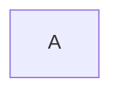

### A Node with Text

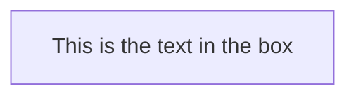

### Unicode Text

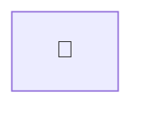

### Markdown Formatting

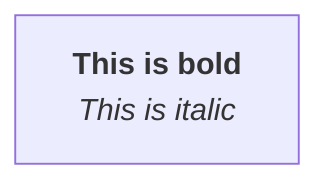

### Direction - Top to Bottom

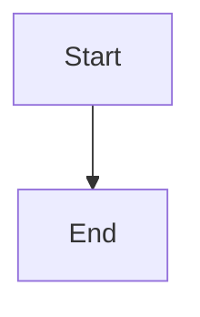

### Direction - Left to Right

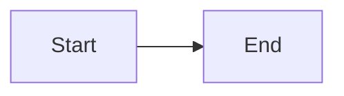

## Node Shapes - Classic Syntax

### Round Edges

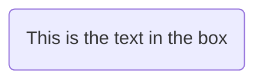

### Stadium-Shaped

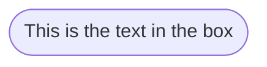

### Subroutine Shape

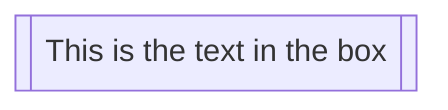

### Cylindrical Shape

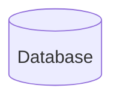

### Circle

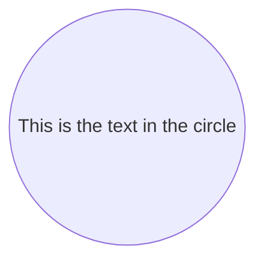

### Asymmetric Shape

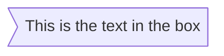

### Rhombus (Diamond)

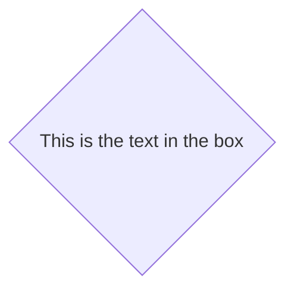

### Hexagon

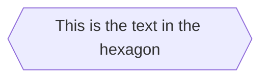

### Parallelogram

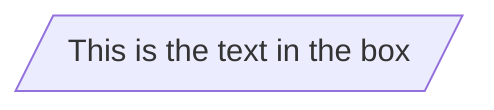

### Parallelogram Alt

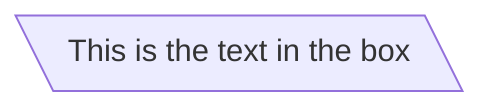

### Trapezoid

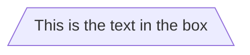

### Trapezoid Alt

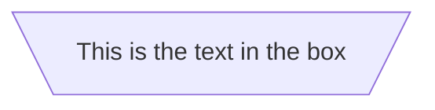

### Double Circle

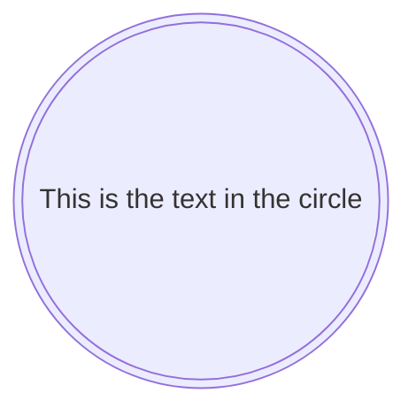

## Expanded Node Shapes

### Process (Rectangle)

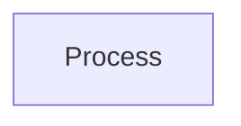

### Event (Rounded Rectangle)

```mermaid
flowchart TD
    A@{ shape: rounded, label: "Event" }
```

### Terminal Point (Stadium)

```mermaid
flowchart TD
    A@{ shape: stadium, label: "Terminal" }
```

### Subprocess (Framed Rectangle)

```mermaid
flowchart TD
    A@{ shape: fr-rect, label: "Subprocess" }
```

### Database (Cylinder)

```mermaid
flowchart TD
    A@{ shape: cyl, label: "Database" }
```

### Start (Circle)

```mermaid
flowchart TD
    A@{ shape: circle, label: "Start" }
```

### Odd

```mermaid
flowchart TD
    A@{ shape: odd, label: "Odd" }
```

### Decision (Diamond)

```mermaid
flowchart TD
    A@{ shape: diam, label: "Decision" }
```

### Prepare Conditional (Hexagon)

```mermaid
flowchart TD
    A@{ shape: hex, label: "Prepare" }
```

### Data Input/Output (Lean Right)

```mermaid
flowchart TD
    A@{ shape: lean-r, label: "Input/Output" }
```

### Data Input/Output (Lean Left)

```mermaid
flowchart TD
    A@{ shape: lean-l, label: "Input/Output" }
```

### Priority Action (Trapezoid Base Bottom)

```mermaid
flowchart TD
    A@{ shape: trap-b, label: "Priority" }
```

### Manual Operation (Trapezoid Base Top)

```mermaid
flowchart TD
    A@{ shape: trap-t, label: "Manual" }
```

### Stop (Double Circle)

```mermaid
flowchart TD
    A@{ shape: dbl-circ, label: "Stop" }
```

### Text Block

```mermaid
flowchart TD
    A@{ shape: text, label: "Text Block" }
```

### Card (Notched Rectangle)

```mermaid
flowchart TD
    A@{ shape: notch-rect, label: "Card" }
```

### Lined/Shaded Process

```mermaid
flowchart TD
    A@{ shape: lin-rect, label: "Lined Process" }
```

### Start (Small Circle)

```mermaid
flowchart TD
    A@{ shape: sm-circ, label: "Start" }
```

### Stop (Framed Circle)

```mermaid
flowchart TD
    A@{ shape: fr-circ, label: "Stop" }
```

### Fork/Join (Long Rectangle)

```mermaid
flowchart TD
    A@{ shape: fork, label: "Fork/Join" }
```

### Collate (Hourglass)

```mermaid
flowchart TD
    A@{ shape: hourglass, label: "Collate" }
```

### Comment (Curly Brace)

```mermaid
flowchart TD
    A@{ shape: brace, label: "Comment" }
```

### Comment Right (Curly Brace Right)

```mermaid
flowchart TD
    A@{ shape: brace-r, label: "Comment Right" }
```

### Comment with Braces on Both Sides

```mermaid
flowchart TD
    A@{ shape: braces, label: "Comment" }
```

### Com Link (Lightning Bolt)

```mermaid
flowchart TD
    A@{ shape: bolt, label: "Com Link" }
```

### Document

```mermaid
flowchart TD
    A@{ shape: doc, label: "Document" }
```

### Delay (Half-Rounded Rectangle)

```mermaid
flowchart TD
    A@{ shape: delay, label: "Delay" }
```

### Direct Access Storage (Horizontal Cylinder)

```mermaid
flowchart TD
    A@{ shape: h-cyl, label: "Direct Access Storage" }
```

### Disk Storage (Lined Cylinder)

```mermaid
flowchart TD
    A@{ shape: lin-cyl, label: "Disk Storage" }
```

### Display (Curved Trapezoid)

```mermaid
flowchart TD
    A@{ shape: curv-trap, label: "Display" }
```

### Divided Process (Divided Rectangle)

```mermaid
flowchart TD
    A@{ shape: div-rect, label: "Divided Process" }
```

### Extract (Small Triangle)

```mermaid
flowchart TD
    A@{ shape: tri, label: "Extract" }
```

### Internal Storage (Window Pane)

```mermaid
flowchart TD
    A@{ shape: win-pane, label: "Internal Storage" }
```

### Junction (Filled Circle)

```mermaid
flowchart TD
    A@{ shape: f-circ, label: "Junction" }
```

### Lined Document

```mermaid
flowchart TD
    A@{ shape: lin-doc, label: "Lined Document" }
```

### Loop Limit (Notched Pentagon)

```mermaid
flowchart TD
    A@{ shape: notch-pent, label: "Loop Limit" }
```

### Manual File (Flipped Triangle)

```mermaid
flowchart TD
    A@{ shape: flip-tri, label: "Manual File" }
```

### Manual Input (Sloped Rectangle)

```mermaid
flowchart TD
    A@{ shape: sl-rect, label: "Manual Input" }
```

### Multi-Document (Stacked Document)

```mermaid
flowchart TD
    A@{ shape: docs, label: "Multi-Document" }
```

### Multi-Process (Stacked Rectangle)

```mermaid
flowchart TD
    A@{ shape: st-rect, label: "Multi-Process" }
```

### Paper Tape (Flag)

```mermaid
flowchart TD
    A@{ shape: flag, label: "Paper Tape" }
```

### Stored Data (Bow Tie Rectangle)

```mermaid
flowchart TD
    A@{ shape: bow-rect, label: "Stored Data" }
```

### Summary (Crossed Circle)

```mermaid
flowchart TD
    A@{ shape: cross-circ, label: "Summary" }
```

### Tagged Document

```mermaid
flowchart TD
    A@{ shape: tag-doc, label: "Tagged Document" }
```

### Tagged Process (Tagged Rectangle)

```mermaid
flowchart TD
    A@{ shape: tag-rect, label: "Tagged Process" }
```

## Links Between Nodes

### Link with Arrow Head

```mermaid
flowchart TD
    A-->B
```

### Open Link

```mermaid
flowchart TD
    A---B
```

### Text on Links

```mermaid
flowchart TD
    A-->|text|B
```

### Link with Arrow and Text (Inline)

```mermaid
flowchart TD
    A-- text -->B
```

### Dotted Link

```mermaid
flowchart TD
    A-.->B
```

### Dotted Link with Text

```mermaid
flowchart TD
    A-.text.->B
```

### Thick Link

```mermaid
flowchart TD
    A==>B
```

### Thick Link with Text

```mermaid
flowchart TD
    A== text ==>B
```

### Invisible Link

```mermaid
flowchart TD
    A ~~~ B
```

### Chaining of Links

```mermaid
flowchart TD
    A --> B --> C
```

### Multiple Nodes Links

```mermaid
flowchart TD
    A --> B
    A --> C
    B --> D
    C --> D
```

### Circle Edge

```mermaid
flowchart TD
    A--oB
```

### Cross Edge

```mermaid
flowchart TD
    A--xB
```

### Multi-Directional Arrows

```mermaid
flowchart TD
    A<-->B
```

### Minimum Length of a Link

```mermaid
flowchart TD
    B[Left]
    B---->C[Right]
```

## Subgraphs

### Basic Subgraph

```mermaid
flowchart TD
    subgraph IDE [Integrated Development Environment]
        A[Write Code]
        B[Review]
        C[Test]
    end
    A-->B-->C
```

### Subgraph with Edges Between Subgraphs

```mermaid
flowchart TD
    subgraph IDE1 [IDE One]
        A[Text]
    end
    subgraph IDE2 [IDE Two]
        B[Text]
    end
    IDE1 --> IDE2
```

### Direction in Subgraphs

```mermaid
flowchart LR
    A[A]
    subgraph sub1 [Left to Right]
        direction LR
        B[B]
        C[C]
    end
    A --> B
    B --> C
```

### Direction in Subgraphs with Limitation

```mermaid
flowchart TD
    A[A]
    B[B]
    subgraph mySubgraph [My Subgraph]
        direction LR
        C[C]
        D[D]
    end
    A --> B
    A --> C
    B --> D
```

## Markdown Strings

### Markdown in Node Labels

```mermaid
flowchart TD
    A["`**bold text**
    _italic text_
    normal text`"]
    B["plain text"]
```

## Special Characters

### Entity Codes to Escape Characters

```mermaid
flowchart TD
    A["This is a string with #35; and #33;"]
```

## Styling and Classes

### Styling a Node

```mermaid
flowchart TD
    A[This is the text in the box]
    style A stroke:#f66,stroke-width:2px,color:#fff,stroke-dasharray: 5 5
```

### Shorter Form with ::: Operator

```mermaid
flowchart TD
    A:::someclass --> B
    classDef someclass fill:#f9f,stroke:#333,stroke-width:4px;
```

### Classes with Multiple Links

```mermaid
flowchart TD
    A:::first --> B:::second
    C:::first --> D:::second
    classDef first fill:#f9f
    classDef second fill:#bbf
```

## FontAwesome Icons

### FontAwesome in Node

```mermaid
flowchart TD
    B[fa:fa-twitter TWEET]
```

## Comments

### Comments in Flowchart

```mermaid
flowchart TD
    %% this is a comment
    A[This is the text in the box]
```

## Complex Example

### Decision Flow

```mermaid
flowchart TD
    A[Start] --> B{Is it?}
    B -->|Yes| C[OK]
    C --> D[Rethink]
    D --> B
    B -->|No| E[End]
```
