## Introduction to Block Diagrams

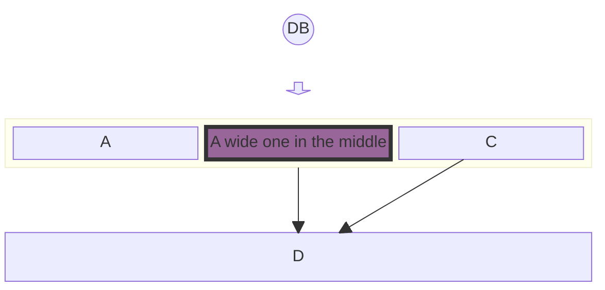

## Simple Block Diagram

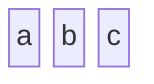

## Multi-Column Diagram

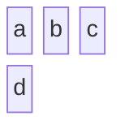

## Block Spanning Multiple Columns

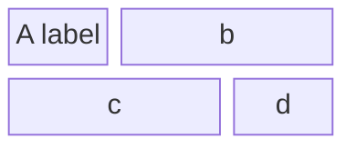

## Composite Blocks

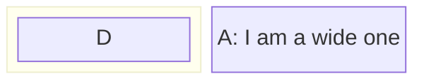

## Dynamic Column Widths

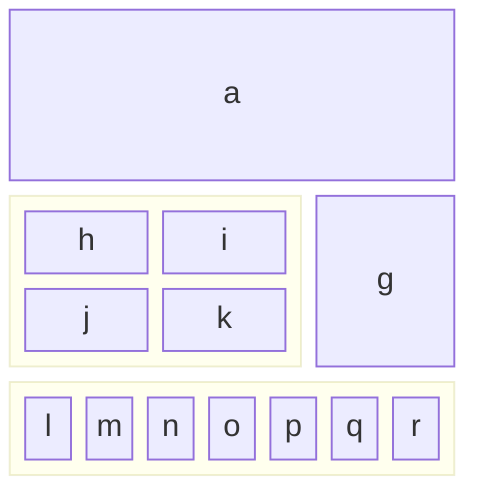

## Merging Blocks Horizontally

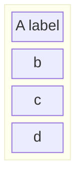

## Round Edged Block

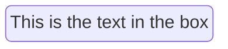

## Stadium-Shaped Block

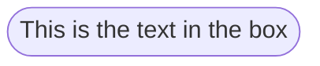

## Subroutine Shape

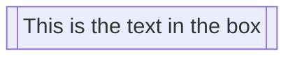

## Cylindrical Shape

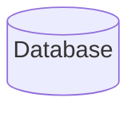

## Circle Shape

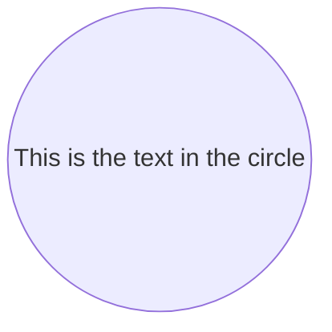

## Asymmetric Shape

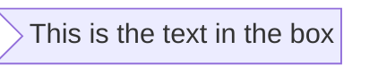

## Rhombus Shape

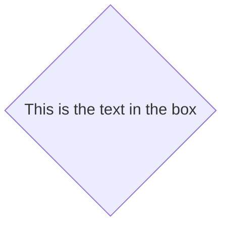

## Hexagon Shape

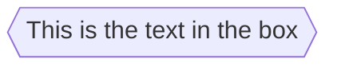

## Parallelogram and Trapezoid Shapes

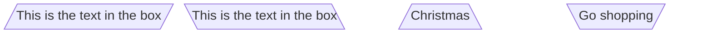

## Double Circle

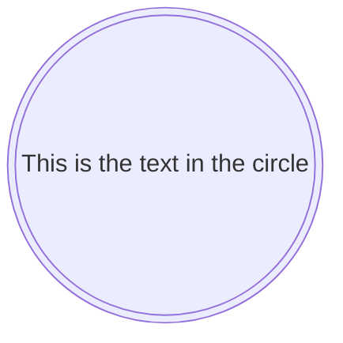

## Block Arrows

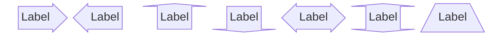

## Space Blocks

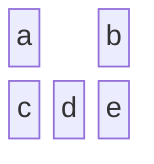

## Space Blocks with Width

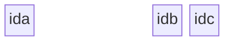

## Basic Links

```mermaid
block
 A space B
 A-->B
```

## Text with Links

```mermaid
block
 A space:2 B
 A-- "X" -->B
```

## Edges and Styles

```mermaid
block
columns 1
 db(("DB"))
 blockArrowId6<[" "]>(down)
 block:ID
 A
 B["A wide one in the middle"]
 C
 end
 space
 D
 ID --> D
 C --> D
 style B fill:#939,stroke:#333,stroke-width:4px
```

## Individual Block Styling

```mermaid
block
 id1 space id2
 id1("Start")-->id2("Stop")
 style id1 fill:#636,stroke:#333,stroke-width:4px
 style id2 fill:#bbf,stroke:#f66,stroke-width:2px,color:#fff,stroke-dasharray: 5 5
```

## Class Styling

```mermaid
block
 A space B
 A-->B
 classDef blue fill:#6e6ce6,stroke:#333,stroke-width:4px;
 class A blue
 style B fill:#bbf,stroke:#f66,stroke-width:2px,color:#fff,stroke-dasharray: 5 5
```

## System Architecture

```mermaid
block
 columns 3
 Frontend blockArrowId6<[" "]>(right) Backend
 space:2 down<[" "]>(down)
 Disk left<[" "]>(left) Database[("Database")]

 classDef front fill:#696,stroke:#333;
 classDef back fill:#969,stroke:#333;
 class Frontend front
 class Backend,Database back
```
