## Animal Hierarchy with Inheritance

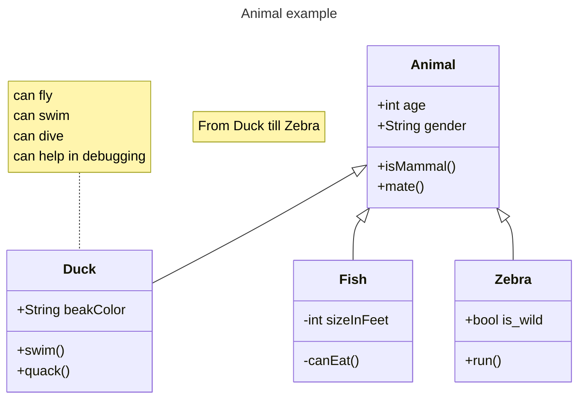

## Bank Account Class with Members

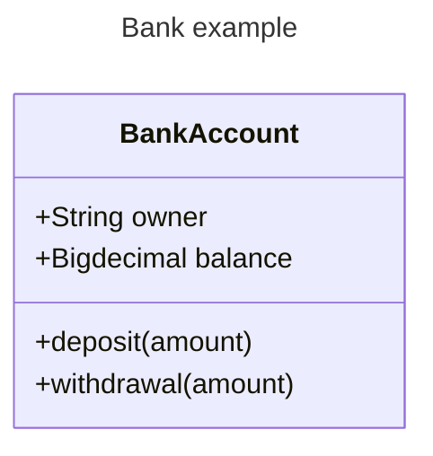

## Basic Class Definition

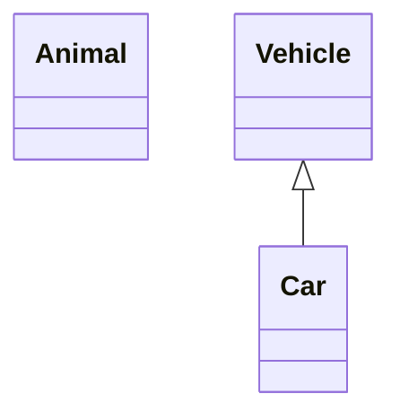

## Class with Labels

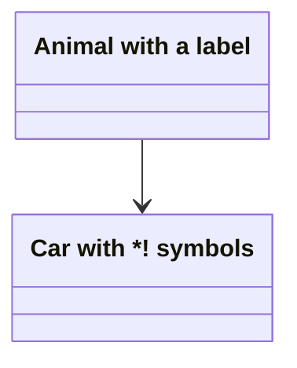

## Class Labels with Backticks

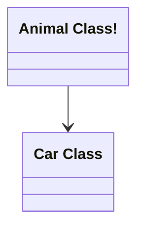

## Members Defined with Colon Syntax

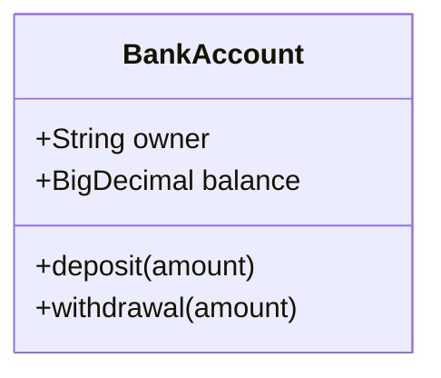

## Members Defined with Curly Braces


## Methods with Return Types

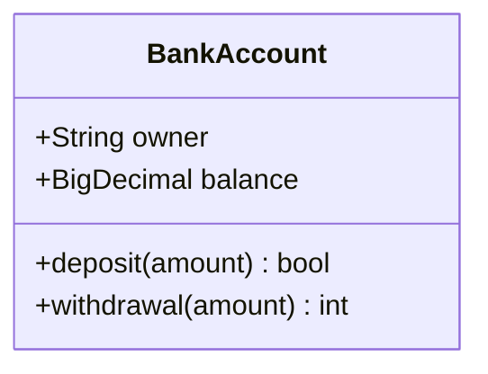

## Generic Types in Class Definition

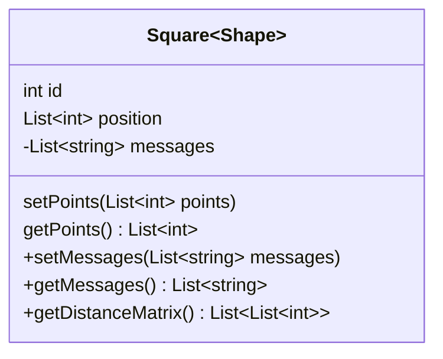

## Relationship Types Demonstration

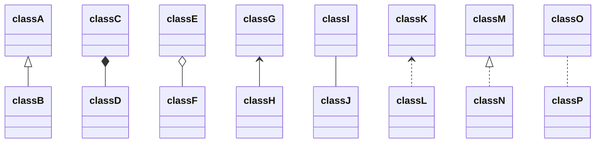

## Relationships with Labels

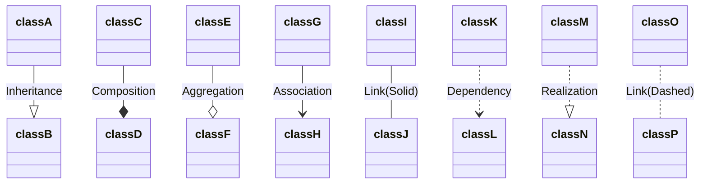

## Labels on Relations

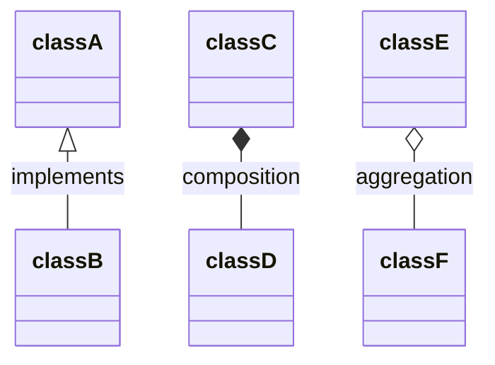

## Two-Way Relations

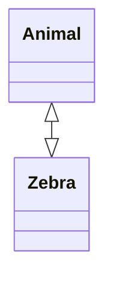

## Lollipop Interface Simple

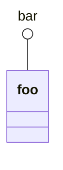

## Lollipop Interface Complex

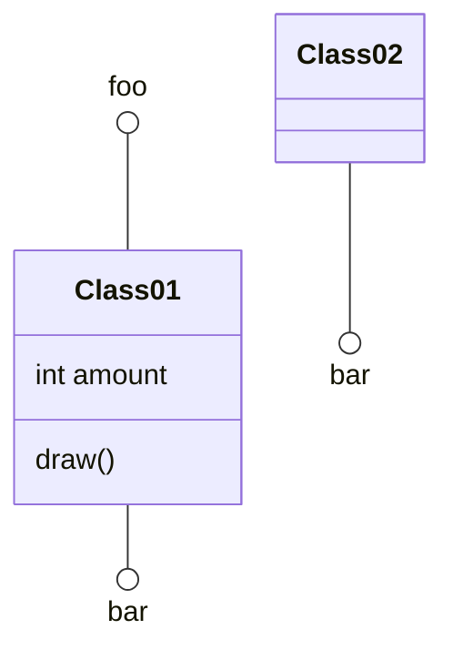

## Namespace Grouping

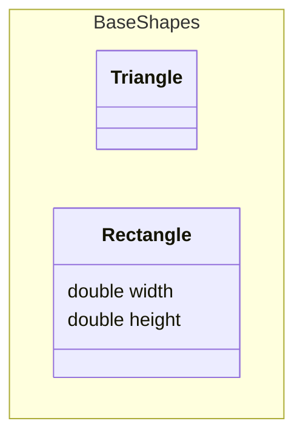

## Cardinality on Relations

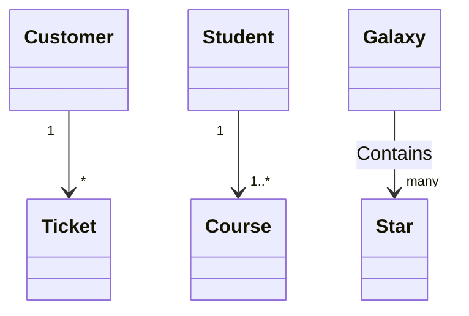

## Annotations - Interface

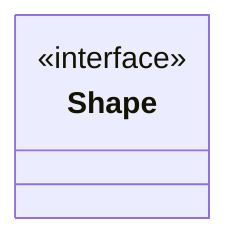

## Annotations - Separate Line

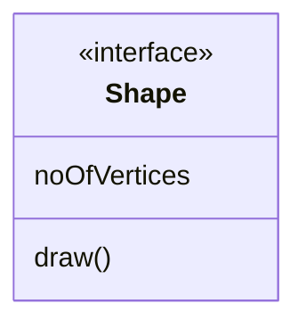

## Annotations - Nested Structure with Enumeration

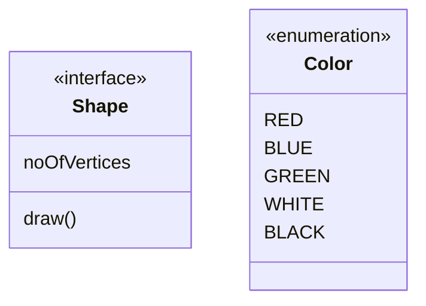

## Diagram Direction Right-to-Left

```mermaid
classDiagram
    direction RL
    class Student {
        -idCard : IdCard
    }
    class IdCard{
        -id : int
        -name : string
    }
    class Bike{
        -id : int
        -name : string
    }
    Student "1" --o "1" IdCard : carries
    Student "1" --o "1" Bike : rides
```

## Notes on Diagram

```mermaid
classDiagram
    note "This is a general note"
    note for MyClass "This is a note for a class"
    class MyClass{
    }
```

## Interactive Links

```mermaid
classDiagram
    class Shape
    link Shape "https://www.github.com" "This is a tooltip for a link"
    class Shape2
    click Shape2 href "https://www.github.com" "This is a tooltip for a link"
```

## Interactive Callbacks

```mermaid
classDiagram
    class Shape
    callback Shape "callbackFunction" "This is a tooltip for a callback"
    class Shape2
    click Shape2 call callbackFunction() "This is a tooltip for a callback"
```

## Combined Interactions

```mermaid
classDiagram
    class Class01
    class Class02
    callback Class01 "callbackFunction" "Callback tooltip"
    link Class02 "https://www.github.com" "This is a link"
    class Class03
    class Class04
    click Class03 call callbackFunction() "Callback tooltip"
    click Class04 href "https://www.github.com" "This is a link"
```

## Styling Individual Nodes

```mermaid
classDiagram
    class Animal
    class Mineral
    style Animal fill:#f9f,stroke:#333,stroke-width:4px
    style Mineral fill:#bbf,stroke:#f66,stroke-width:2px,color:#fff,stroke-dasharray: 5 5
```

## CSS Classes Styling

```mermaid
classDiagram
    class Animal:::styleClass
    class Mineral:::styleClass2

    classDef styleClass fill:#f9f,stroke:#333,stroke-width:4px
    classDef styleClass2 fill:#bbf,stroke:#f66,stroke-width:2px
```

## Default Class Styling

```mermaid
classDiagram
    class Animal
    class Mineral

    classDef default fill:#f9f,stroke:#333,stroke-width:4px
```

## Static and Abstract Members

```mermaid
classDiagram
    class Shape {
        someAbstractMethod()*
        someStaticMethod()$
        String someField$
    }
```

## Protected and Package Visibility

```mermaid
classDiagram
    class BankAccount {
        #String accountNumber
        ~int internalId
    }
```
