## Order Example with Title

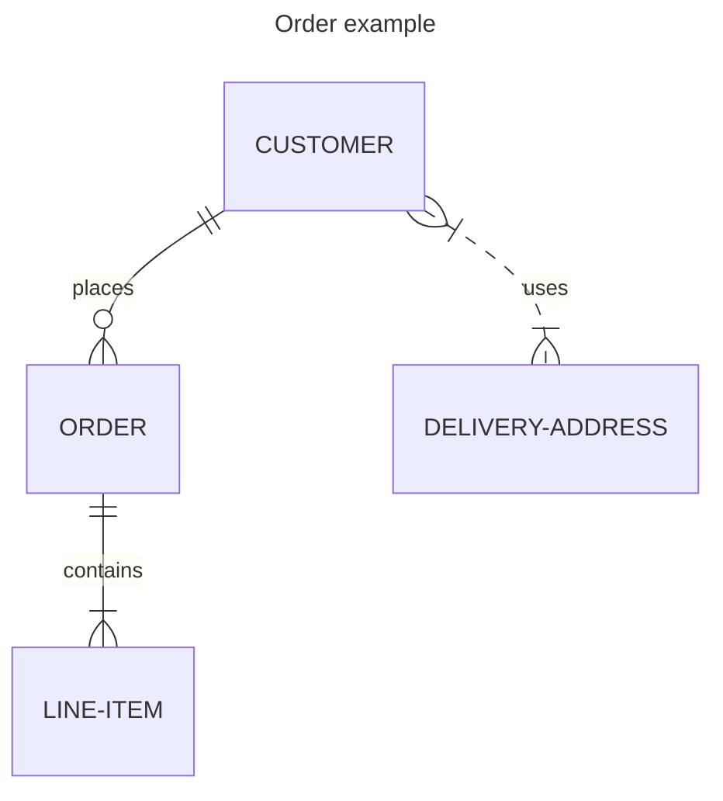

## Entities with Attributes

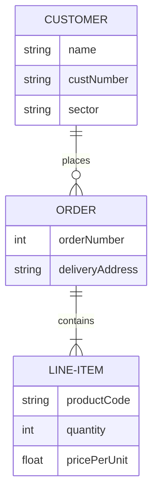

## Unicode Text in Entity Names

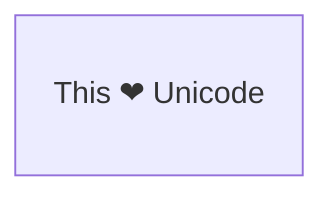

## Markdown Formatting in Entity Names

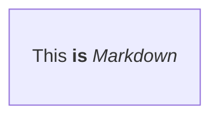

## Identifying and Non-Identifying Relationships

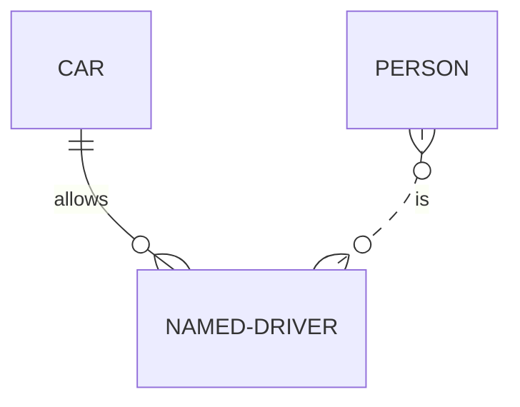

## Relationships with Aliases

## Entities with Typed Attributes

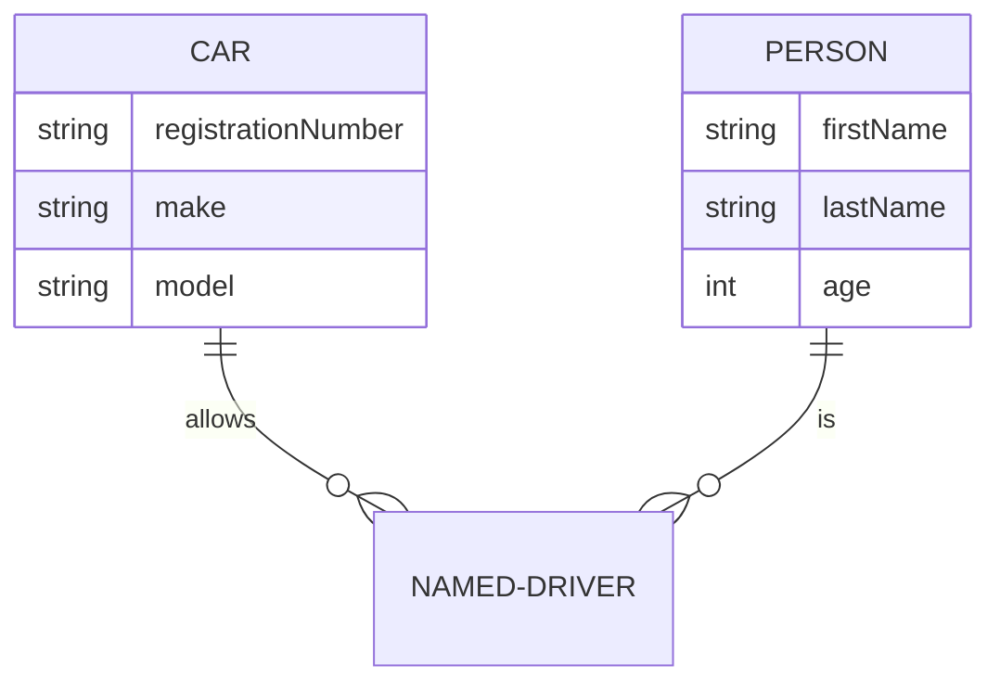

## Entity Name Aliases

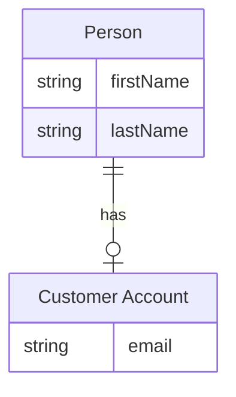

## Attribute Keys and Comments

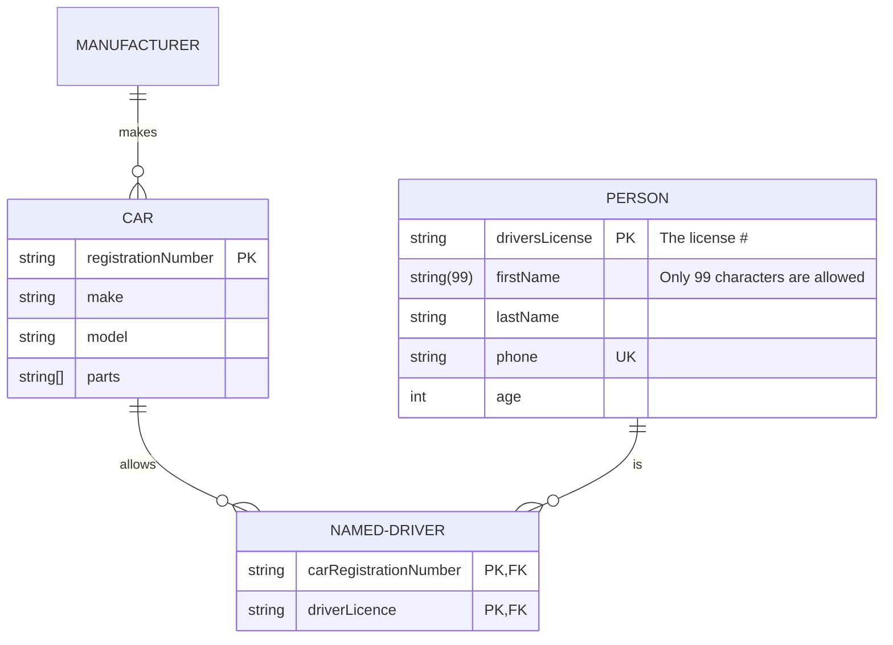

## Direction Top-to-Bottom

## Direction Left-to-Right

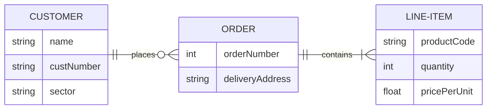

## Styling Nodes with Inline Style

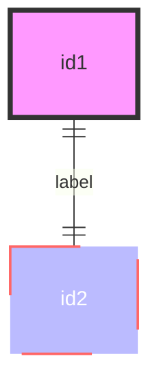

## Styling Nodes with classDef

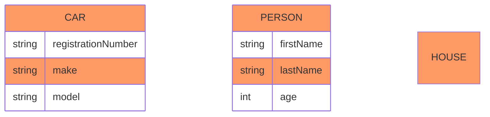

## Styling Relationships with classDef

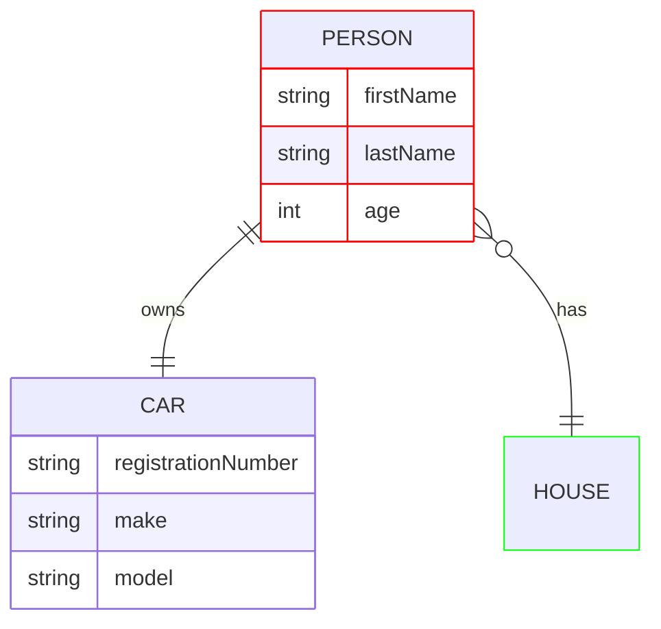

## Default Class Definition

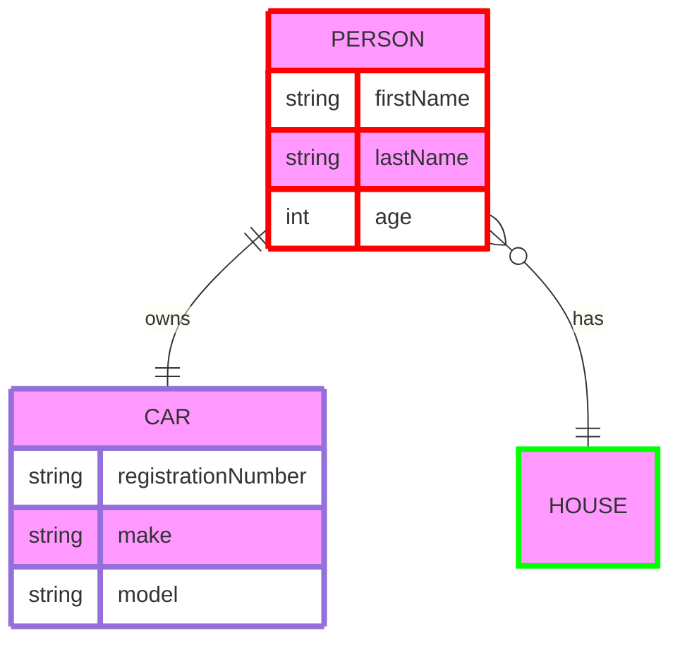

## ELK Layout Configuration

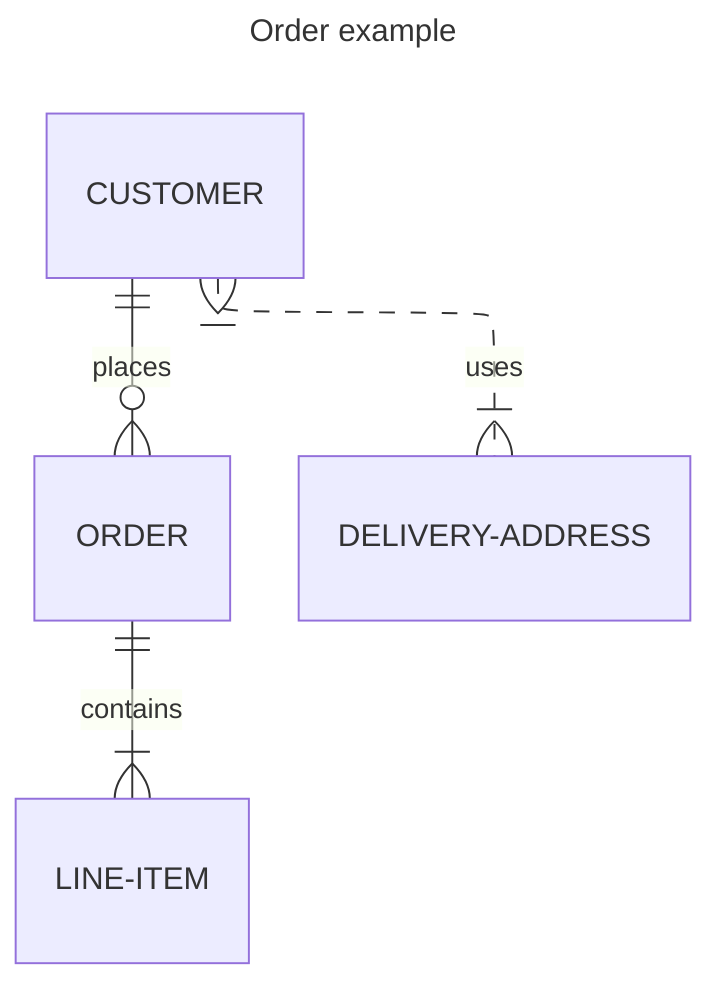
