## Default node

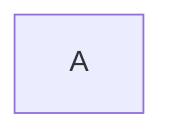

## Node with text

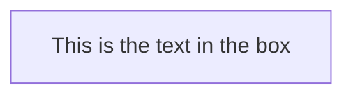

## Unicode text in node

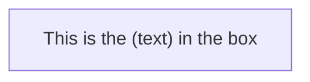

## Markdown formatting in node

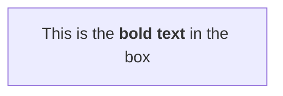

## Top to bottom direction

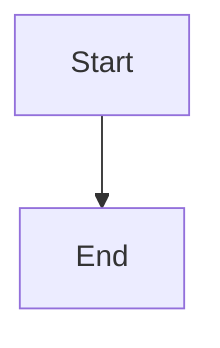

## Left to right direction

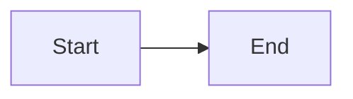

## Node with round edges

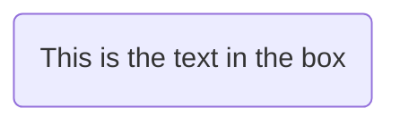

## Stadium-shaped node

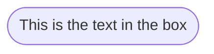

## Subroutine shape

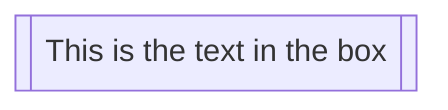

## Cylindrical shape

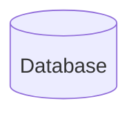

## Circle node

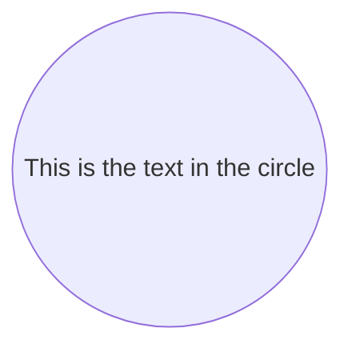

## Asymmetric shape

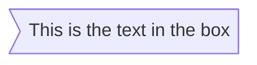

## Rhombus shape

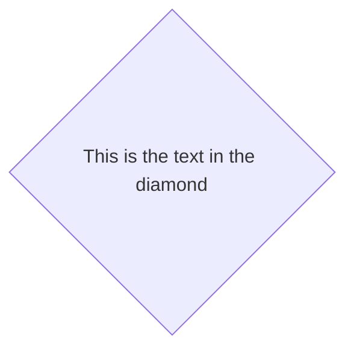

## Hexagon node

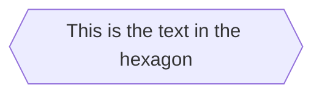

## Parallelogram

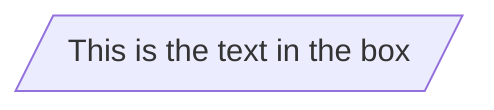

## Parallelogram alt

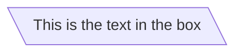

## Trapezoid

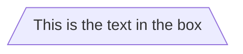

## Trapezoid alt

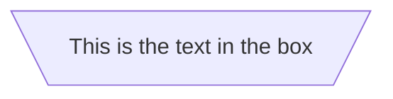

## Double circle

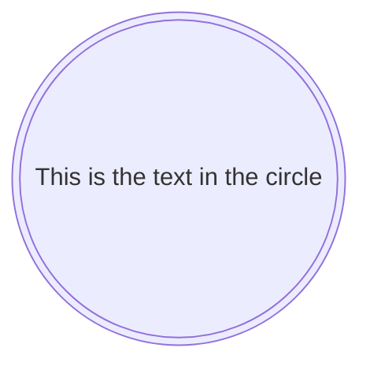

## New shapes syntax

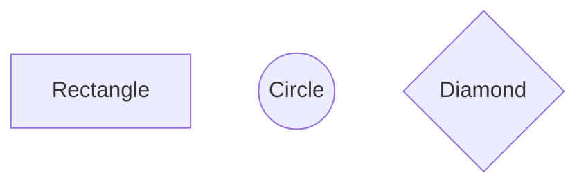

## Process shape

```mermaid
flowchart TD
    A@{ shape: rect }
```

## Event shape

```mermaid
flowchart TD
    A@{ shape: rounded }
```

## Terminal point stadium

```mermaid
flowchart TD
    A@{ shape: stadium }
```

## Subprocess shape

```mermaid
flowchart TD
    A@{ shape: fr-rect }
```

## Database cylinder

```mermaid
flowchart TD
    A@{ shape: cyl }
```

## Start circle

```mermaid
flowchart TD
    A@{ shape: circle }
```

## Odd shape

```mermaid
flowchart TD
    A@{ shape: odd }
```

## Decision diamond

```mermaid
flowchart TD
    A@{ shape: diam }
```

## Prepare conditional hexagon

```mermaid
flowchart TD
    A@{ shape: hex }
```

## Data input output lean right

```mermaid
flowchart TD
    A@{ shape: lean-r }
```

## Data input output lean left

```mermaid
flowchart TD
    A@{ shape: lean-l }
```

## Priority action trapezoid bottom

```mermaid
flowchart TD
    A@{ shape: trap-b }
```

## Manual operation trapezoid top

```mermaid
flowchart TD
    A@{ shape: trap-t }
```

## Stop double circle

```mermaid
flowchart TD
    A@{ shape: dbl-circ }
```

## Text block

```mermaid
flowchart TD
    A@{ shape: text }
```

## Card notched rectangle

```mermaid
flowchart TD
    A@{ shape: notch-rect }
```

## Lined shaded process

```mermaid
flowchart TD
    A@{ shape: lin-rect }
```

## Start small circle

```mermaid
flowchart TD
    A@{ shape: sm-circ }
```

## Stop framed circle

```mermaid
flowchart TD
    A@{ shape: fr-circ }
```

## Fork join

```mermaid
flowchart TD
    A@{ shape: fork }
```

## Collate hourglass

```mermaid
flowchart TD
    A@{ shape: hourglass }
```

## Comment curly brace

```mermaid
flowchart TD
    A@{ shape: brace }
```

## Comment curly brace right

```mermaid
flowchart TD
    A@{ shape: brace-r }
```

## Comment braces both sides

```mermaid
flowchart TD
    A@{ shape: braces }
```

## Communication link bolt

```mermaid
flowchart TD
    A@{ shape: bolt }
```

## Document shape

```mermaid
flowchart TD
    A@{ shape: doc }
```

## Delay half-rounded rectangle

```mermaid
flowchart TD
    A@{ shape: delay }
```

## Direct access storage horizontal cylinder

```mermaid
flowchart TD
    A@{ shape: h-cyl }
```

## Disk storage lined cylinder

```mermaid
flowchart TD
    A@{ shape: lin-cyl }
```

## Display curved trapezoid

```mermaid
flowchart TD
    A@{ shape: curv-trap }
```

## Divided process

```mermaid
flowchart TD
    A@{ shape: div-rect }
```

## Extract small triangle

```mermaid
flowchart TD
    A@{ shape: tri }
```

## Internal storage window pane

```mermaid
flowchart TD
    A@{ shape: win-pane }
```

## Junction filled circle

```mermaid
flowchart TD
    A@{ shape: f-circ }
```

## Lined document

```mermaid
flowchart TD
    A@{ shape: lin-doc }
```

## Loop limit notched pentagon

```mermaid
flowchart TD
    A@{ shape: notch-pent }
```

## Manual file flipped triangle

```mermaid
flowchart TD
    A@{ shape: flip-tri }
```

## Manual input sloped rectangle

```mermaid
flowchart TD
    A@{ shape: sl-rect }
```

## Multi-document stacked

```mermaid
flowchart TD
    A@{ shape: docs }
```

## Multi-process stacked rectangle

```mermaid
flowchart TD
    A@{ shape: st-rect }
```

## Paper tape flag

```mermaid
flowchart TD
    A@{ shape: flag }
```

## Stored data bow tie rectangle

```mermaid
flowchart TD
    A@{ shape: bow-rect }
```

## Summary crossed circle

```mermaid
flowchart TD
    A@{ shape: cross-circ }
```

## Tagged document

```mermaid
flowchart TD
    A@{ shape: tag-doc }
```

## Tagged process

```mermaid
flowchart TD
    A@{ shape: tag-rect }
```

## Bang shape

```mermaid
flowchart TD
    A@{ shape: bang }
```

## Cloud shape

```mermaid
flowchart TD
    A@{ shape: cloud }
```

## Icon shape

```mermaid
flowchart TD
    A@{ shape: icon, icon: "fa:fa-heart", form: "circle", label: "Heart" }
```

## Image shape

```mermaid
flowchart TD
    A@{ img: "https://example.com/image.png", label: "Image Label", pos: "t", w: 60, h: 60, constraint: "off" }
```

## Image with aspect ratio constraint

```mermaid
flowchart TD
    A@{ img: "https://example.com/image.png", label: "Image", w: 100, h: 100, constraint: "on" }
```

## Link with arrow head

```mermaid
flowchart TD
    A-->B
```

## Open link no arrow

```mermaid
flowchart TD
    A---B
```

## Text on link

```mermaid
flowchart TD
    A---|text|B
```

## Text on link alternative syntax

```mermaid
flowchart TD
    A-- text ---B
```

## Link with arrow and text

```mermaid
flowchart TD
    A-->|text|B
```

## Link with arrow and text alternative

```mermaid
flowchart TD
    A-- text -->B
```

## Dotted link

```mermaid
flowchart TD
    A-.->B
```

## Dotted link with text

```mermaid
flowchart TD
    A-. text .->B
```

## Thick link

```mermaid
flowchart TD
    A==>B
```

## Thick link with text

```mermaid
flowchart TD
    A== text ==>B
```

## Invisible link

```mermaid
flowchart TD
    A~~~B
```

## Chaining links

```mermaid
flowchart TD
    A-->B-->C
```

## Multiple node connections

```mermaid
flowchart TD
    A-->B
    A-->C
    B-->D
    C-->D
```

## Expressive chaining

```mermaid
flowchart TD
    A-->B-->C
    A-->D-->C
    B-->E
```

## Basic chaining syntax

```mermaid
flowchart TD
    A-->B
    B-->C
    C-->D
    D-->E
    E-->F
```

## Edge with ID

```mermaid
flowchart TD
    e1@-->A-->B
```

## Edge animation

```mermaid
flowchart TD
    e1@-->A-->B
    e1{ animate: true }
```

## Edge animation fast

```mermaid
flowchart TD
    e1@-->A-->B
    e1{ animation: fast }
```

## Edge animation slow

```mermaid
flowchart TD
    e1@-->A-->B
    e1{ animation: slow }
```

## Edge class with animation

```mermaid
flowchart TD
    e1@-->A-->B
    classDef animate { animation: fast }
    class e1 animate
```

## Circle edge

```mermaid
flowchart TD
    A--o B
```

## Cross edge

```mermaid
flowchart TD
    A--x B
```

## Multi-directional arrows

```mermaid
flowchart TD
    A<-->B
```

## Link with extra length

```mermaid
flowchart TD
    B-->E
    B----E
```

## Link with label and extra length

```mermaid
flowchart TD
    B-- text ---E
```

## Special characters in nodes

```mermaid
flowchart TD
    A["This is (parentheses)"]
    B["A common mistake is writing"]
    C["if s(i1,1) then"]
```

## Entity codes

```mermaid
flowchart TD
    A["A[B]"]
```

## Basic subgraph

```mermaid
flowchart TD
    subgraph title
        A --> B
    end
```

## Subgraph with explicit ID

```mermaid
flowchart TD
    subgraph sgID["This is a subgraph"]
        A --> B
    end
```

## Flowchart with multiple subgraphs

```mermaid
flowchart TB
    c1-->a2
    subgraph one
        a1-->a2
    end
    subgraph two
        b1-->b2
    end
    subgraph three
        c1-->c2
    end
    one --> two
    three --> two
    two --> c2
```

## Direction in subgraphs

```mermaid
flowchart LR
    subgraph TOP
        direction TB
        subgraph B1
            direction RL
            i1 -->f1
        end
        subgraph B2
            direction BT
            i2 -->f2
        end
    end
    A --> TOP --> B
    B1 --> B2
```

## Markdown strings

```mermaid
flowchart TD
    A["`**Bold** text`"]
    B["`*Italic* text`"]
    C["`Multi
    line text`"]
```

## Click event with callback

```mermaid
flowchart TD
    A --> B
    click A callback "Tooltip"
```

## Click with URL link

```mermaid
flowchart TD
    A --> B
    B --> C
    click B "https://www.github.com" "This is a link"
```

## Click with href

```mermaid
flowchart TD
    A --> B
    click A href "https://www.github.com" "Link"
```

## Comments in flowchart

```mermaid
flowchart TD
    A --> B
    %% This is a comment
    B --> C
```

## Styling a link

```mermaid
flowchart TD
    A --> B
    linkStyle 0 stroke:#ff3,stroke-width:4px,color:red
```

## Styling multiple links

```mermaid
flowchart TD
    A --> B --> C --> D
    linkStyle 1,2 color:blue
```

## Edge level curve style

```mermaid
flowchart TD
    e1@-->A-->B
    e1{ curve: linear }
```

## Styling a node

```mermaid
flowchart TD
    A --> B
    style A fill:#f9f,stroke:#333,stroke-width:4px
```

## Class definition and attachment

```mermaid
flowchart TD
    A --> B
    classDef className fill:#f9f,stroke:#333,stroke-width:4px
    class A className
```

## Class attachment with shorthand operator

```mermaid
flowchart TD
    A:::className --> B
    classDef className fill:#f9f,stroke:#333,stroke-width:4px
```

## Default class styling

```mermaid
flowchart TD
    A --> B
    classDef default fill:#f9f,stroke:#333,stroke-width:4px
```

## FontAwesome icons in nodes

```mermaid
flowchart TD
    B[fa:fa-twitter]
```

## Custom FontAwesome icons

```mermaid
flowchart TD
    B[fa:fa-twitter]
    B-->E(fak:fa-custom-icon-name)
```

## ELK renderer configuration

```mermaid
---
config:
  flowchart:
    defaultRenderer: "elk"
---
flowchart LR
    A --> B --> C
```
