## Example Git Diagram

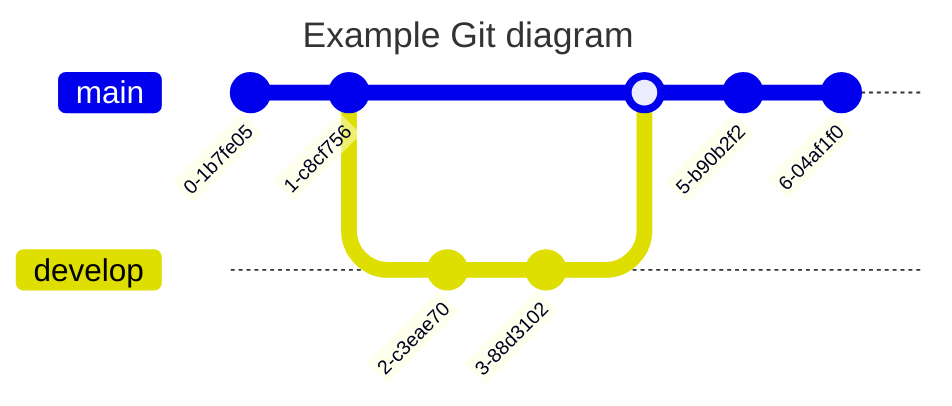

## Simple Three Commits

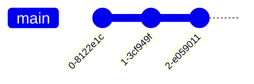

## Custom Commit IDs

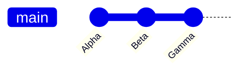

## Different Commit Types

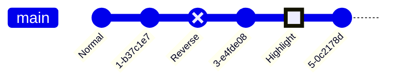

## Commits with Tags

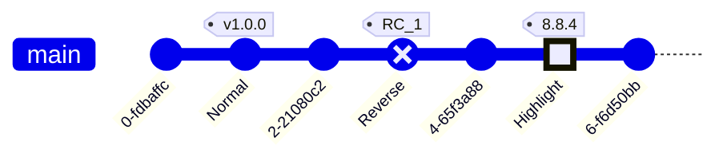

## Create New Branch

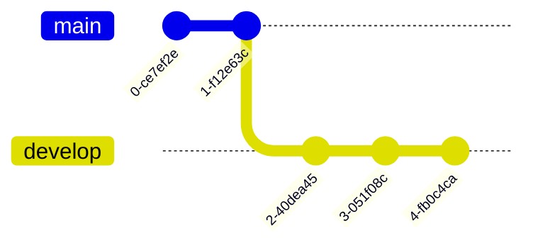

## Checkout Existing Branch

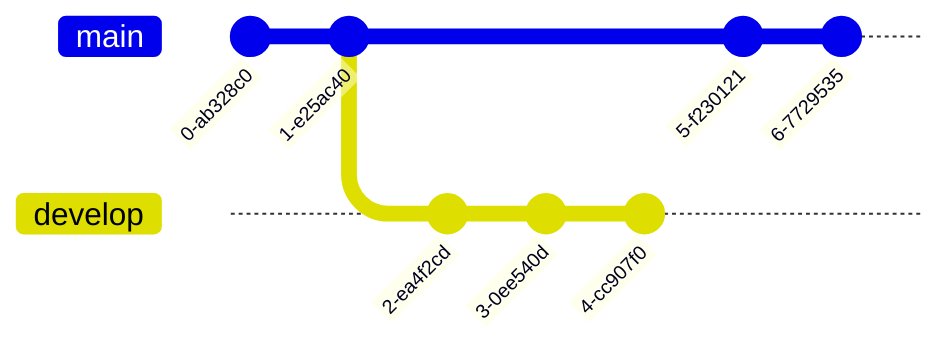

## Merging Branches

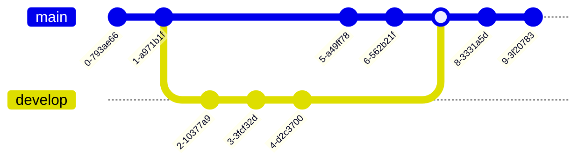

## Merge with Custom Attributes

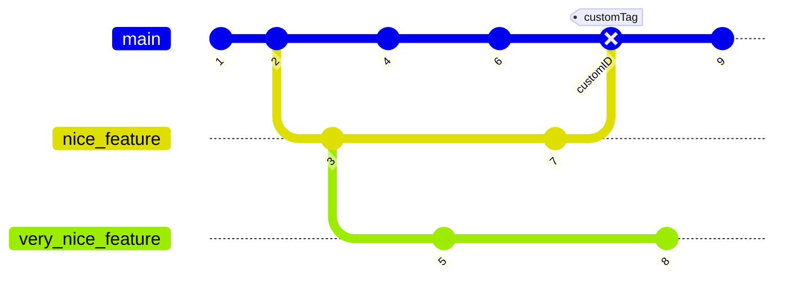

## Cherry-Pick with Merge Commit Parent

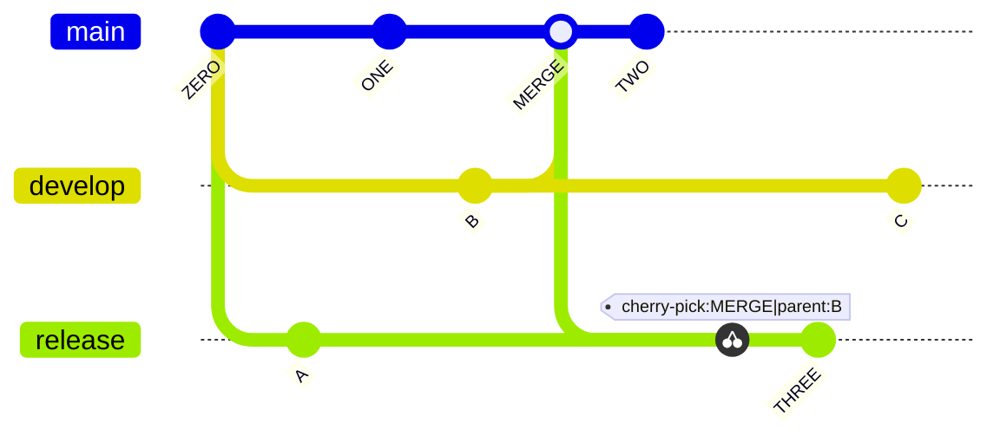

## Hide Branch Names

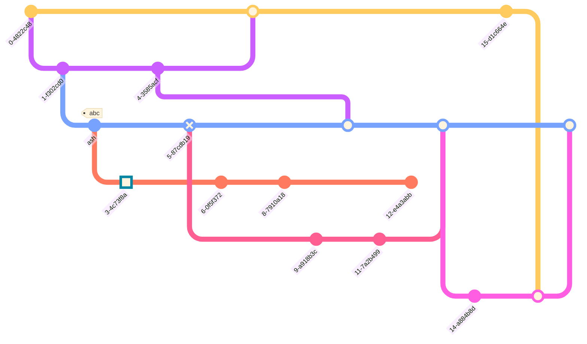

## Rotated Commit Labels

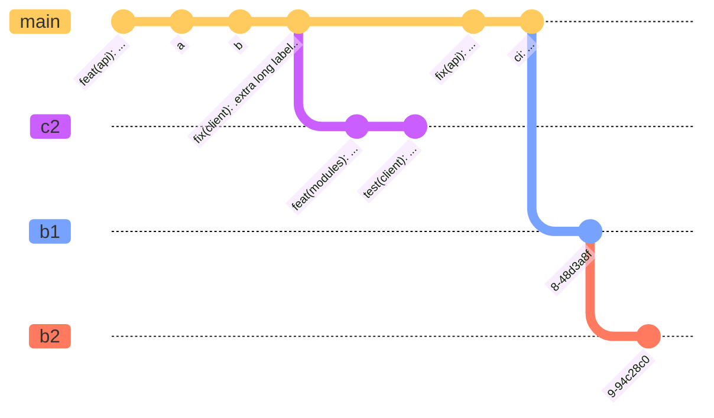

## Horizontal Commit Labels

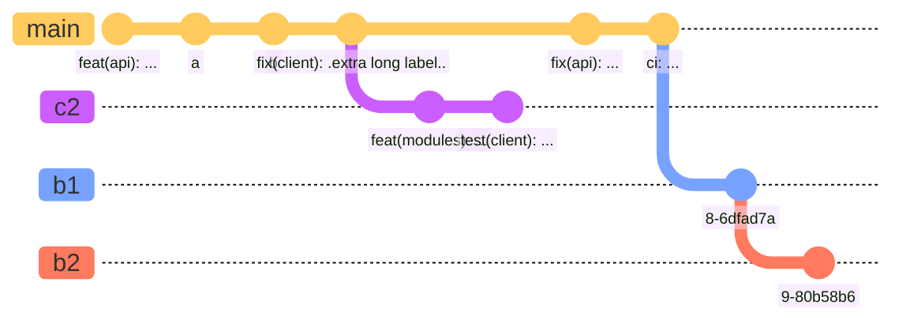

## Hide Commit Labels

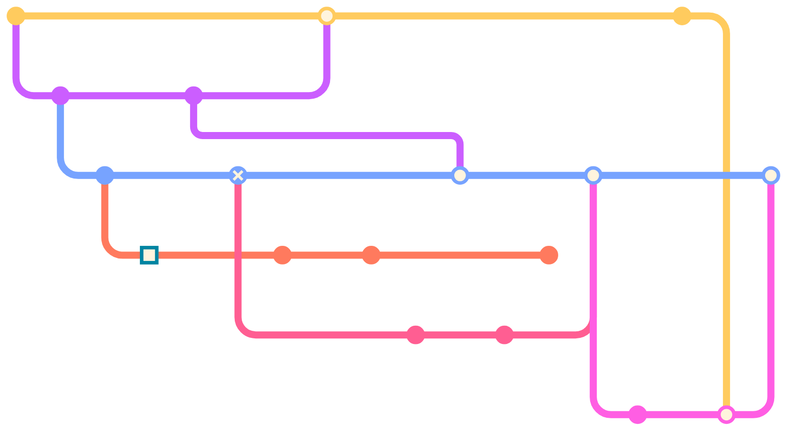

## Custom Main Branch Name

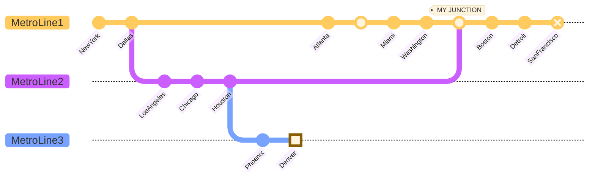

## Branch Ordering with Custom Order

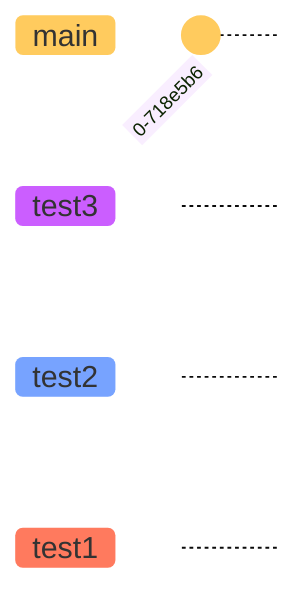

## Branch Ordering with Main Branch Order

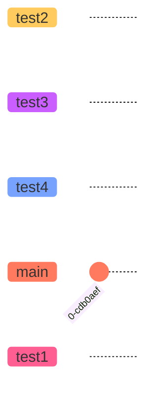

## Left to Right Orientation

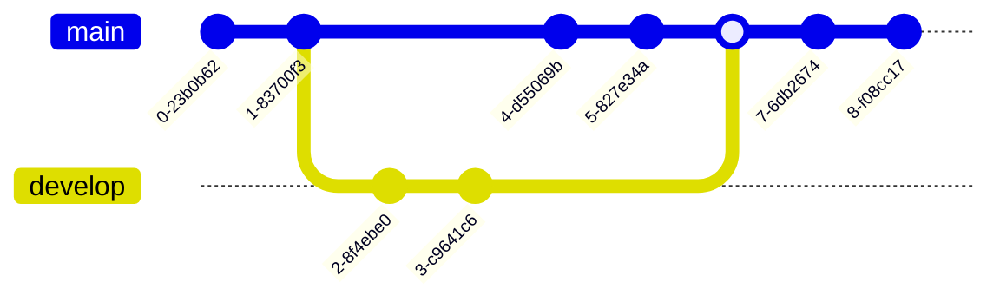

## Top to Bottom Orientation

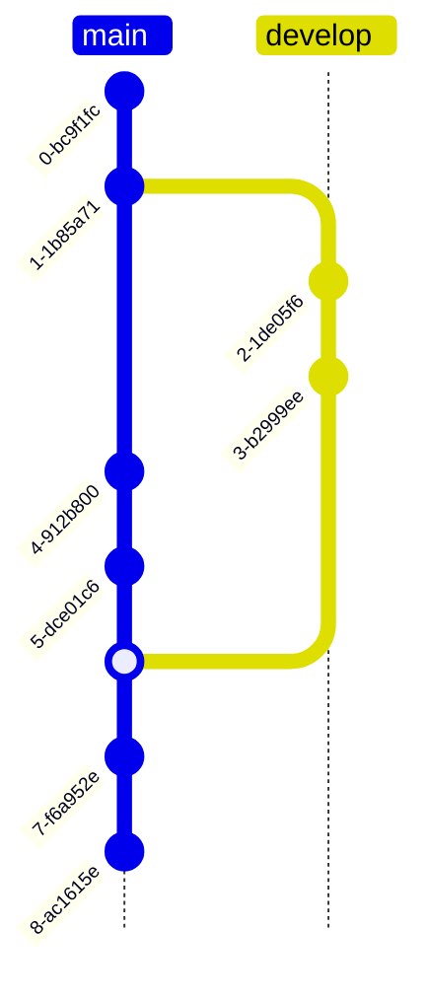

## Bottom to Top Orientation

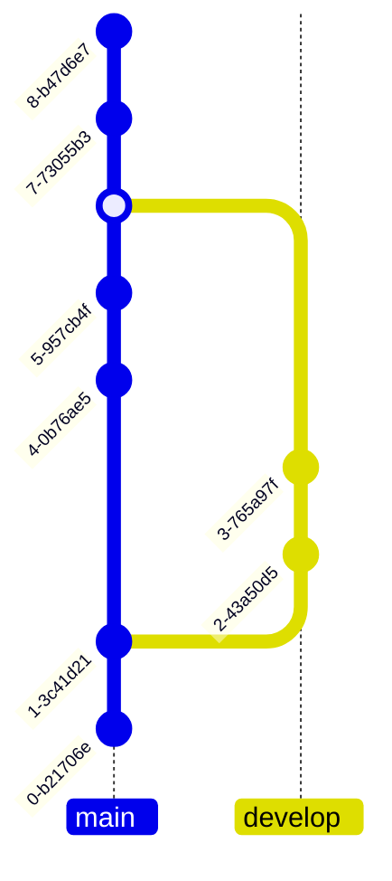

## Temporal Commits (Default)

```mermaid
---
config:
  gitGraph:
    parallelCommits: false
---
gitGraph:
   commit
   branch develop
   commit
   commit
   checkout main
   commit
   commit
```

## Parallel Commits Enabled

```mermaid
---
config:
  gitGraph:
    parallelCommits: true
---
gitGraph:
   commit
   branch develop
   commit
   commit
   checkout main
   commit
   commit
```

## Base Theme

```mermaid
---
config:
  logLevel: 'debug'
  theme: 'base'
---
gitGraph
   commit
   branch hotfix
   checkout hotfix
   commit
   branch develop
   checkout develop
   commit id:"ash" tag:"abc"
   branch featureB
   checkout featureB
   commit type:HIGHLIGHT
   checkout main
   checkout hotfix
   commit type:NORMAL
   checkout develop
   commit type:REVERSE
   checkout featureB
   commit
   checkout main
   merge hotfix
   checkout featureB
   commit
   checkout develop
   branch featureA
   commit
   checkout develop
   merge hotfix
   checkout featureA
   commit
   checkout featureB
   commit
   checkout develop
   merge featureA
   branch release
   checkout release
   commit
   checkout main
   commit
   checkout release
   merge main
   checkout develop
   merge release
```

## Forest Theme

```mermaid
---
config:
  logLevel: 'debug'
  theme: 'forest'
---
gitGraph
   commit
   branch hotfix
   checkout hotfix
   commit
   branch develop
   checkout develop
   commit id:"ash" tag:"abc"
   branch featureB
   checkout featureB
   commit type:HIGHLIGHT
   checkout main
   checkout hotfix
   commit type:NORMAL
   checkout develop
   commit type:REVERSE
   checkout featureB
   commit
   checkout main
   merge hotfix
   checkout featureB
   commit
   checkout develop
   branch featureA
   commit
   checkout develop
   merge hotfix
   checkout featureA
   commit
   checkout featureB
   commit
   checkout develop
   merge featureA
   branch release
   checkout release
   commit
   checkout main
   commit
   checkout release
   merge main
   checkout develop
   merge release
```

## Default Theme

```mermaid
---
config:
  logLevel: 'debug'
  theme: 'default'
---
gitGraph
   commit type:HIGHLIGHT
   branch hotfix
   checkout hotfix
   commit
   branch develop
   checkout develop
   commit id:"ash" tag:"abc"
   branch featureB
   checkout featureB
   commit type:HIGHLIGHT
   checkout main
   checkout hotfix
   commit type:NORMAL
   checkout develop
   commit type:REVERSE
   checkout featureB
   commit
   checkout main
   merge hotfix
   checkout featureB
   commit
   checkout develop
   branch featureA
   commit
   checkout develop
   merge hotfix
   checkout featureA
   commit
   checkout featureB
   commit
   checkout develop
   merge featureA
   branch release
   checkout release
   commit
   checkout main
   commit
   checkout release
   merge main
   checkout develop
   merge release
```

## Dark Theme

```mermaid
---
config:
  logLevel: 'debug'
  theme: 'dark'
---
gitGraph
   commit
   branch hotfix
   checkout hotfix
   commit
   branch develop
   checkout develop
   commit id:"ash" tag:"abc"
   branch featureB
   checkout featureB
   commit type:HIGHLIGHT
   checkout main
   checkout hotfix
   commit type:NORMAL
   checkout develop
   commit type:REVERSE
   checkout featureB
   commit
   checkout main
   merge hotfix
   checkout featureB
   commit
   checkout develop
   branch featureA
   commit
   checkout develop
   merge hotfix
   checkout featureA
   commit
   checkout featureB
   commit
   checkout develop
   merge featureA
   branch release
   checkout release
   commit
   checkout main
   commit
   checkout release
   merge main
   checkout develop
   merge release
```

## Neutral Theme

```mermaid
---
config:
  logLevel: 'debug'
  theme: 'neutral'
---
gitGraph
   commit
   branch hotfix
   checkout hotfix
   commit
   branch develop
   checkout develop
   commit id:"ash" tag:"abc"
   branch featureB
   checkout featureB
   commit type:HIGHLIGHT
   checkout main
   checkout hotfix
   commit type:NORMAL
   checkout develop
   commit type:REVERSE
   checkout featureB
   commit
   checkout main
   merge hotfix
   checkout featureB
   commit
   checkout develop
   branch featureA
   commit
   checkout develop
   merge hotfix
   checkout featureA
   commit
   checkout featureB
   commit
   checkout develop
   merge featureA
   branch release
   checkout release
   commit
   checkout main
   commit
   checkout release
   merge main
   checkout develop
   merge release
```

## Customizing Branch Colors

```mermaid
%%{init: { 'logLevel': 'debug', 'theme': 'base', 'gitGraph': {'mainBranchName': 'main', 'mainBranchOrder': 0}, 'themeVariables': { 'git0': '#ff0000', 'git1': '#00ff00', 'git2': '#0000ff', 'git3': '#ffff00'}} }%%
gitGraph
   commit id: "1"
   commit id: "2"
   branch develop
   commit id: "3"
   commit id: "4"
   checkout main
   commit id: "5"
   merge develop
```

## Customizing Branch Label Colors

```mermaid
%%{init: { 'logLevel': 'debug', 'theme': 'base', 'themeVariables': { 'gitBranchLabel0': '#ffffff', 'gitBranchLabel1': '#000000', 'gitBranchLabel2': '#ffff00'}} }%%
gitGraph
   commit id: "1"
   commit id: "2"
   branch develop
   commit id: "3"
   commit id: "4"
   checkout main
   commit id: "5"
   merge develop
   branch branch1
   commit id: "6"
   branch branch2
   commit id: "7"
   branch test4
   commit id: "8"
```

## Customizing Commit Colors

```mermaid
%%{init: { 'logLevel': 'debug', 'theme': 'base', 'themeVariables': { 'commitLabelColor': '#ff0000', 'commitLabelBackground': '#00ff00'}} }%%
gitGraph
   commit id: "1"
   commit id: "2"
   branch develop
   commit id: "3"
```

## Customizing Commit Label Font Size

```mermaid
%%{init: { 'logLevel': 'debug', 'theme': 'base', 'themeVariables': { 'commitLabelFontSize': '16px'}} }%%
gitGraph
   commit id: "1"
   commit id: "2"
```

## Customizing Tag Label Font Size

```mermaid
%%{init: { 'logLevel': 'debug', 'theme': 'base', 'themeVariables': { 'tagLabelFontSize': '14px'}} }%%
gitGraph
   commit id: "1" tag: "v1.0"
   commit id: "2" tag: "v1.1"
```

## Customizing Tag Colors

```mermaid
%%{init: { 'logLevel': 'debug', 'theme': 'base', 'themeVariables': { 'tagLabelColor': '#ffffff', 'tagLabelBackground': '#ff0000', 'tagLabelBorder': '#000000'}} }%%
gitGraph
   commit id: "1" tag: "v1.0"
   commit id: "2" tag: "v1.1"
```

## Customizing Highlight Commit Colors

```mermaid
%%{init: { 'logLevel': 'debug', 'theme': 'base', 'themeVariables': { 'gitInv0': '#ff0000'}} }%%
gitGraph
   commit id: "1" type: HIGHLIGHT
   commit id: "2"
   branch develop
   commit id: "3" type: HIGHLIGHT
```
