## Basic Mindmap

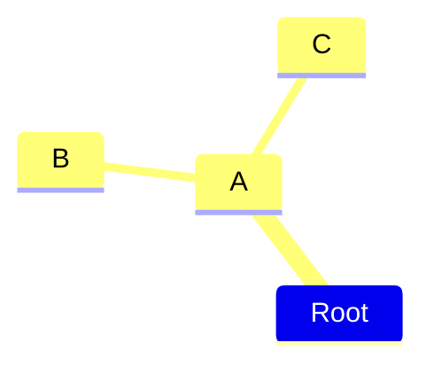

## Default Shape

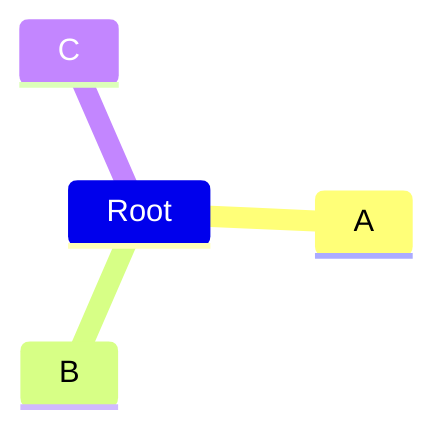

## Square Shape

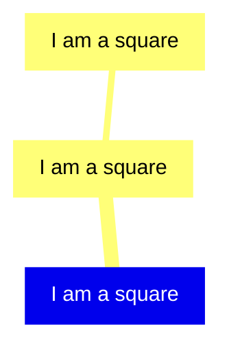

## Rounded Square Shape

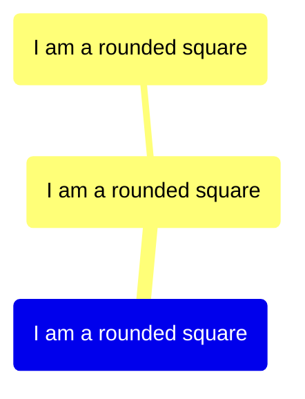

## Circle Shape

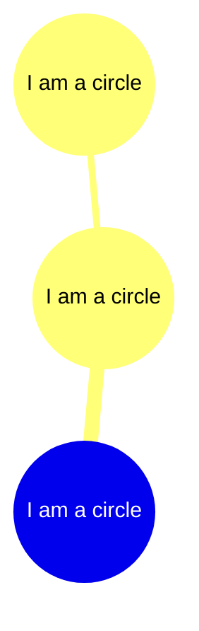

## Bang Shape

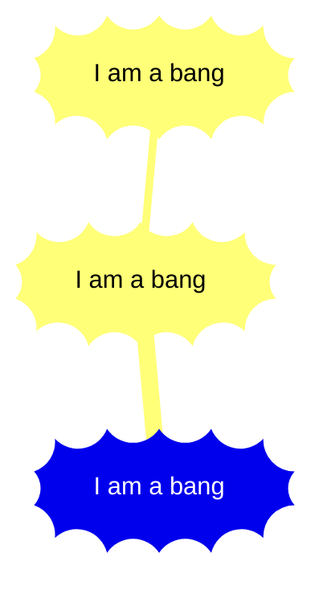

## Cloud Shape

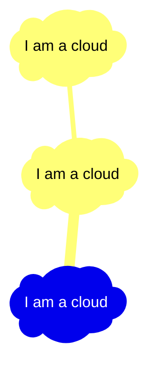

## Hexagon Shape

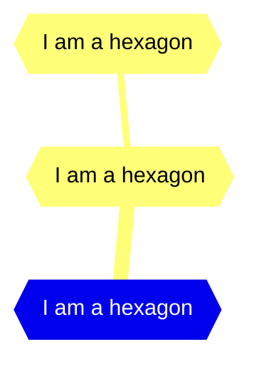

## Icons

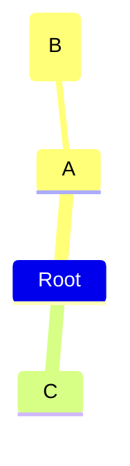

## Classes

```mermaid
mindmap
  Root
    A[A]
      B[B]
      C[C]
        ::icon(fa fa-book)
        D[Important]:::urgent
```

## Unclear Indentation

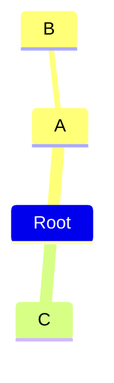

## Markdown Strings

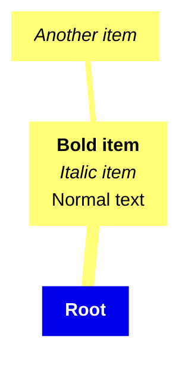

## Tidy Tree Layout

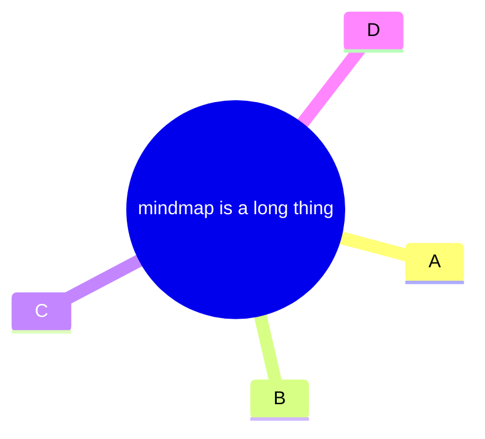

## Comprehensive Mindmap Example

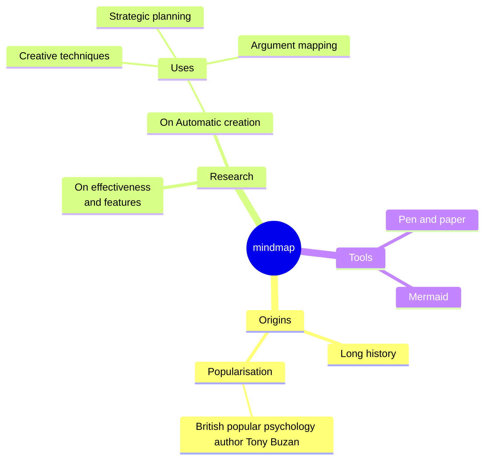
