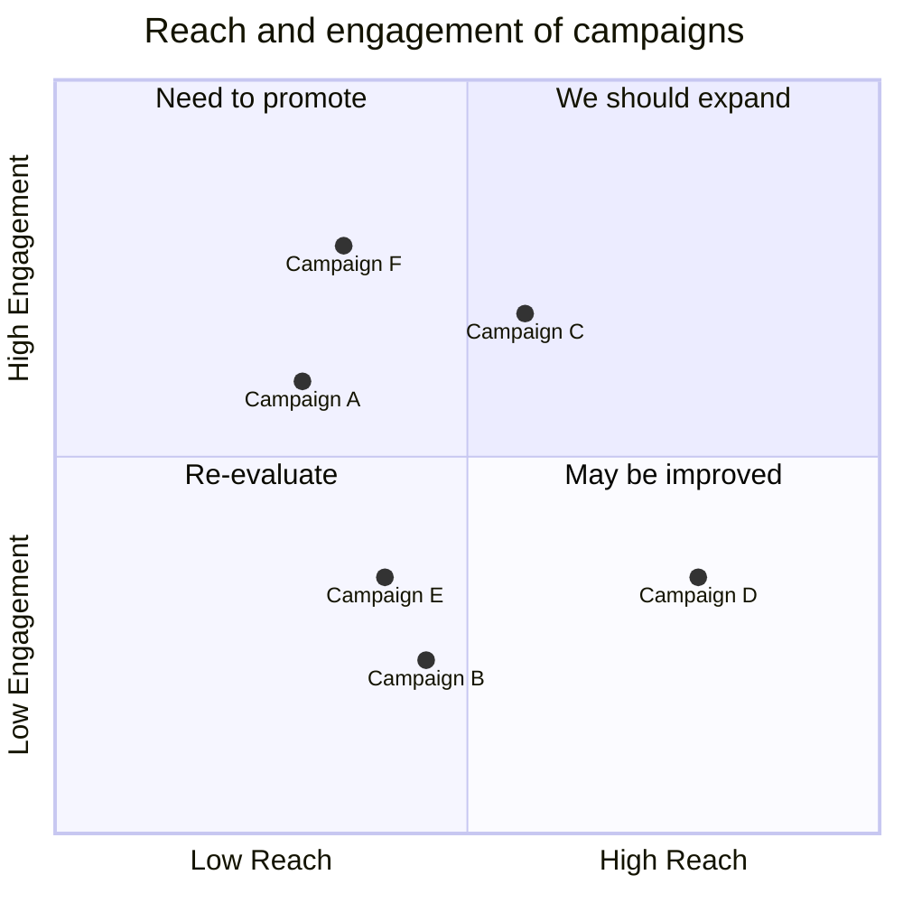
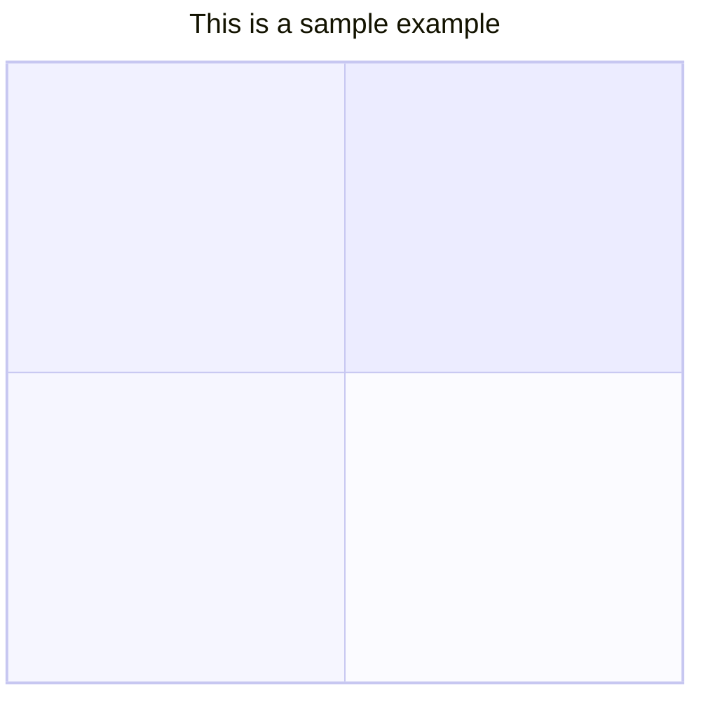
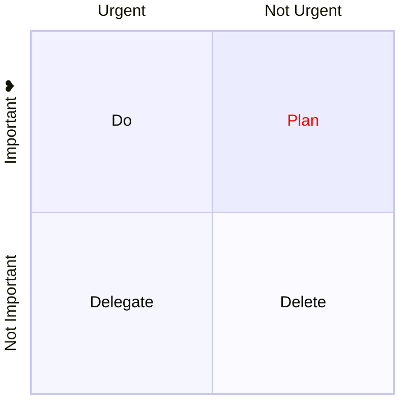
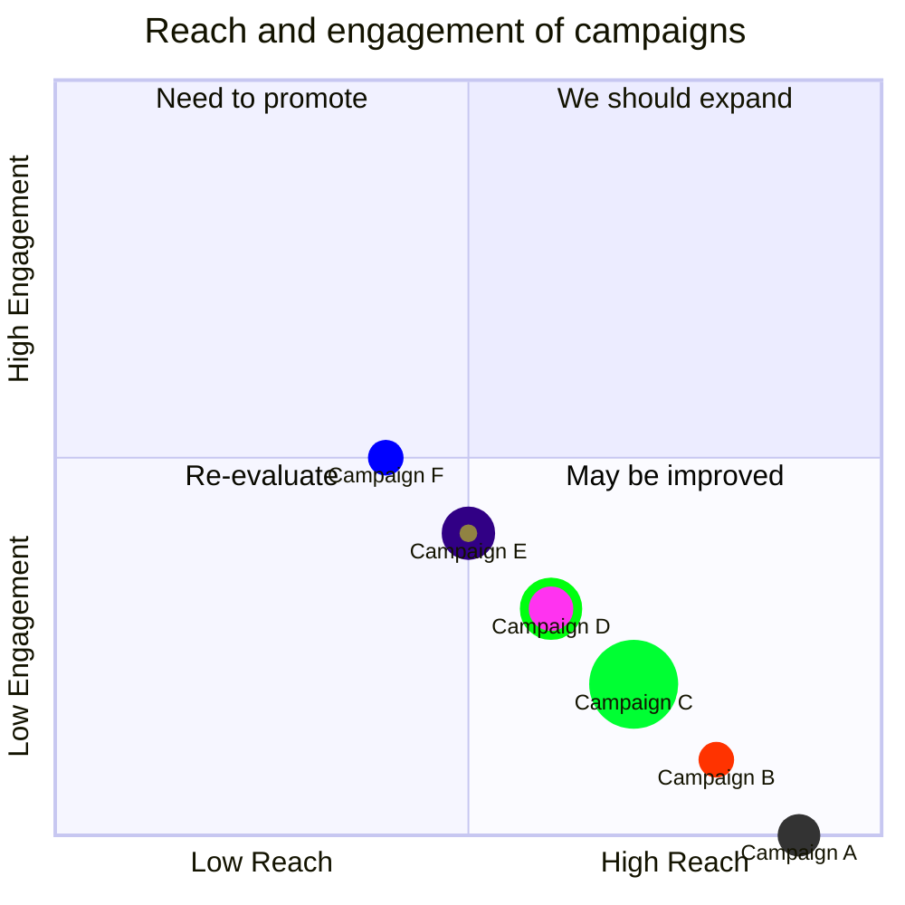

## Basic Quadrant Chart

```mermaid
quadrantChart
    title Reach and engagement of campaigns
    x-axis Low Reach --> High Reach
    y-axis Low Engagement --> High Engagement
    quadrant-1 We should expand
    quadrant-2 Need to promote
    quadrant-3 Re-evaluate
    quadrant-4 May be improved
    Campaign A: [0.3, 0.6]
    Campaign B: [0.45, 0.23]
    Campaign C: [0.57, 0.69]
    Campaign D: [0.78, 0.34]
    Campaign E: [0.40, 0.34]
    Campaign F: [0.35, 0.78]
```

## Title Only

```mermaid
quadrantChart
    title This is a sample example
```

## Config and Theme Customization

```mermaid
---
config:
    quadrantChart:
        chartWidth: 400
        chartHeight: 400
    themeVariables:
        quadrant1TextFill: "#ff0000"
---
quadrantChart
    x-axis Urgent --> Not Urgent
    y-axis Not Important --> "Important ❤"
    quadrant-1 Plan
    quadrant-2 Do
    quadrant-3 Delegate
    quadrant-4 Delete
```

## Point Styling with Inline Properties and Class Definitions

```mermaid
quadrantChart
    title Reach and engagement of campaigns
    x-axis Low Reach --> High Reach
    y-axis Low Engagement --> High Engagement
    quadrant-1 We should expand
    quadrant-2 Need to promote
    quadrant-3 Re-evaluate
    quadrant-4 May be improved
    Campaign A: [0.9, 0.0] radius: 12
    Campaign B:::class1: [0.8, 0.1] color: #ff3300, radius: 10
    Campaign C: [0.7, 0.2] radius: 25, color: #00ff33, stroke-color: #10f0f0
    Campaign D: [0.6, 0.3] radius: 15, stroke-color: #00ff0f, stroke-width: 5px, color: #ff33f0
    Campaign E:::class2: [0.5, 0.4]
    Campaign F:::class3: [0.4, 0.5] color: #0000ff
    classDef class1 color: #109060
    classDef class2 color: #908342, radius: 10, stroke-color: #310085, stroke-width: 10px
    classDef class3 color: #f00fff, radius: 10
```
