## Basic Sequence Diagram

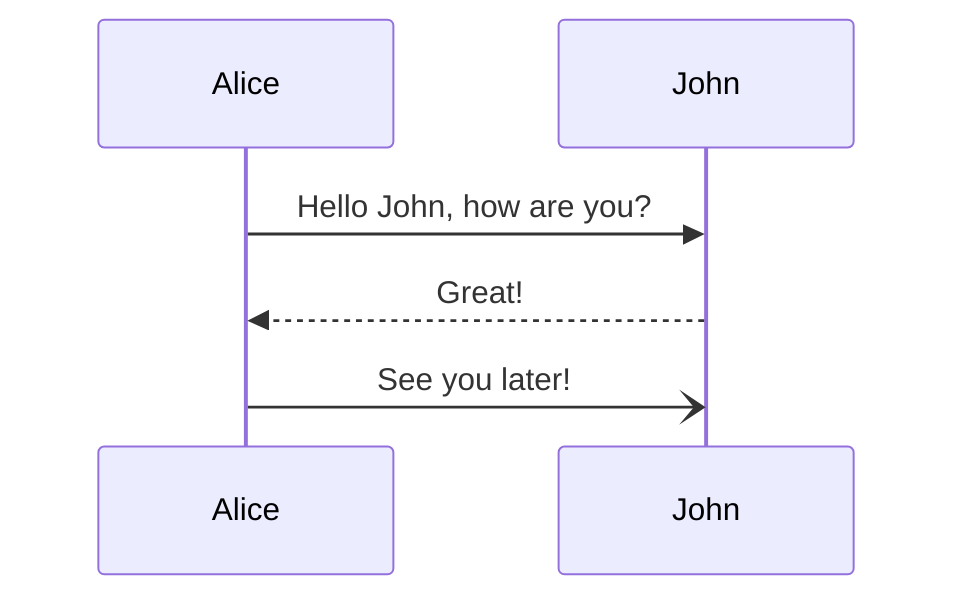

## Explicit Participant Declaration

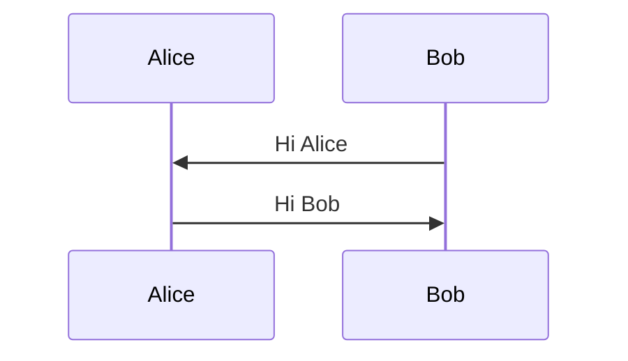

## Actor Symbol

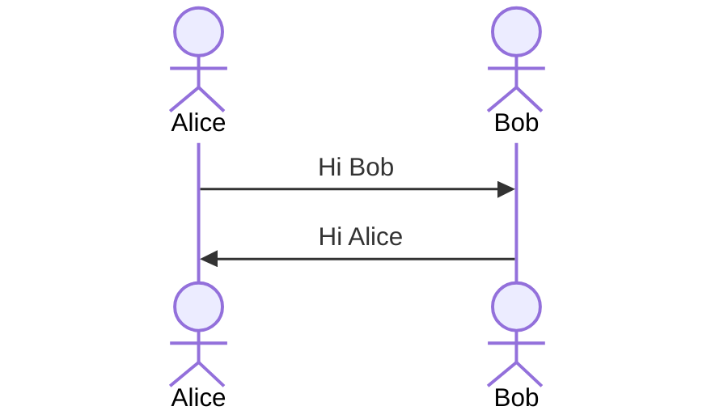

## Boundary Participant

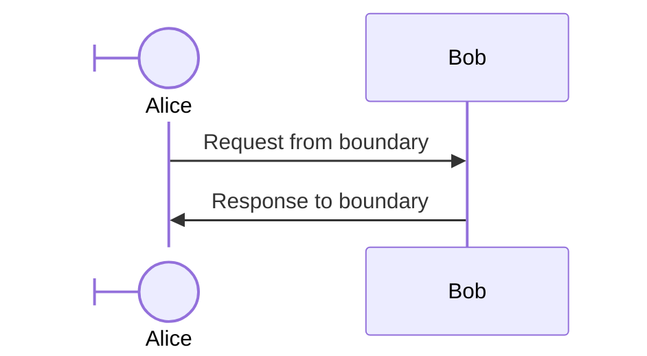

## Control Participant

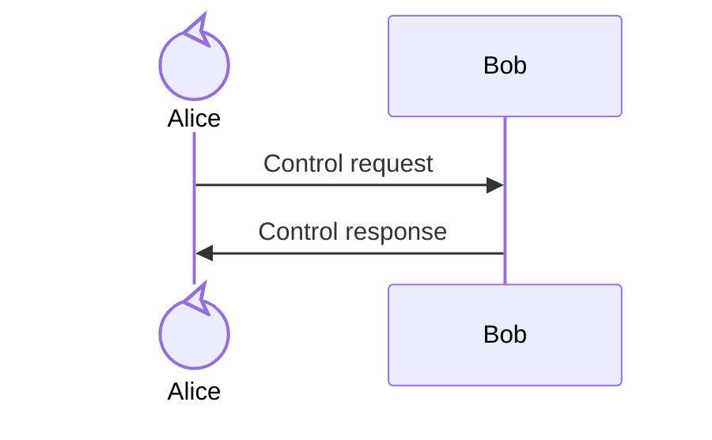

## Entity Participant

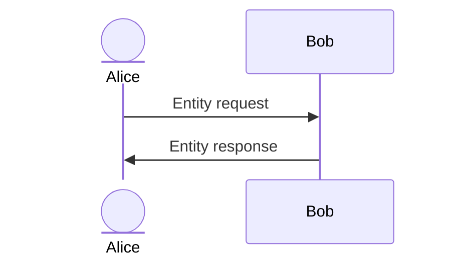

## Database Participant

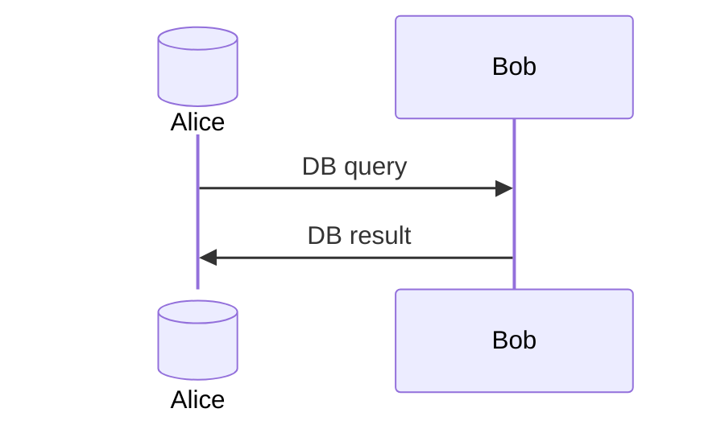

## Collections Participant

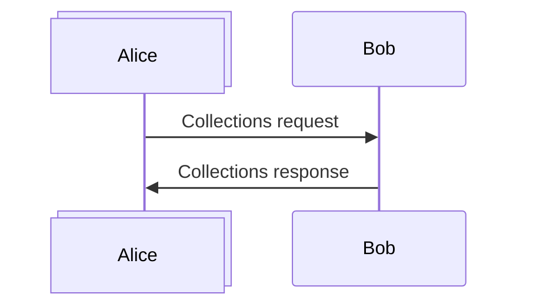

## Queue Participant

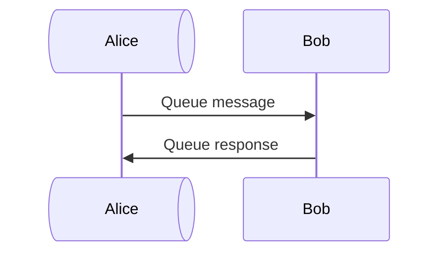

## External Alias Syntax

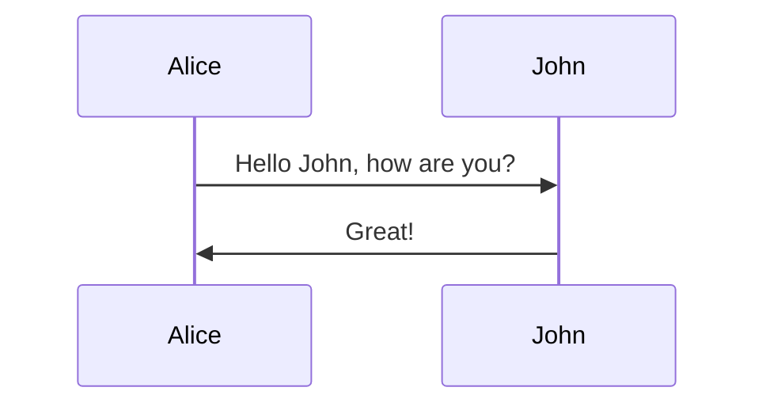

## External Alias with Stereotypes

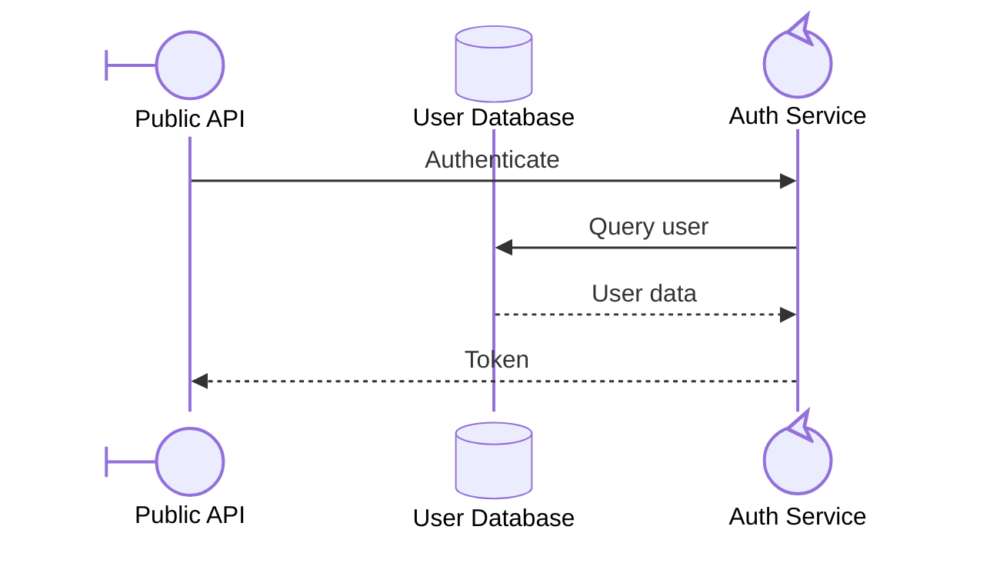

## Inline Alias Syntax

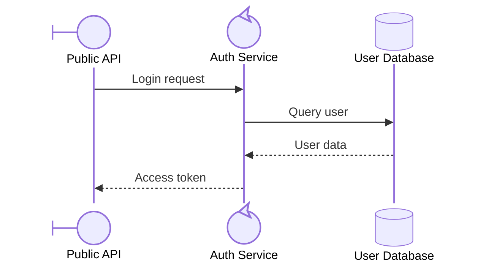

## Alias Precedence with External Override

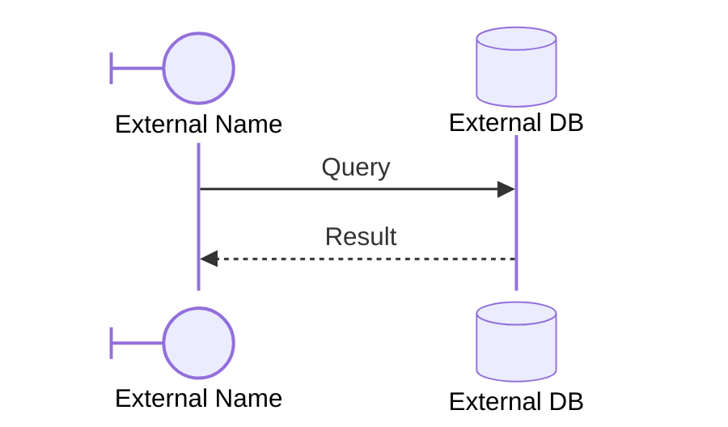

## Actor Creation and Destruction

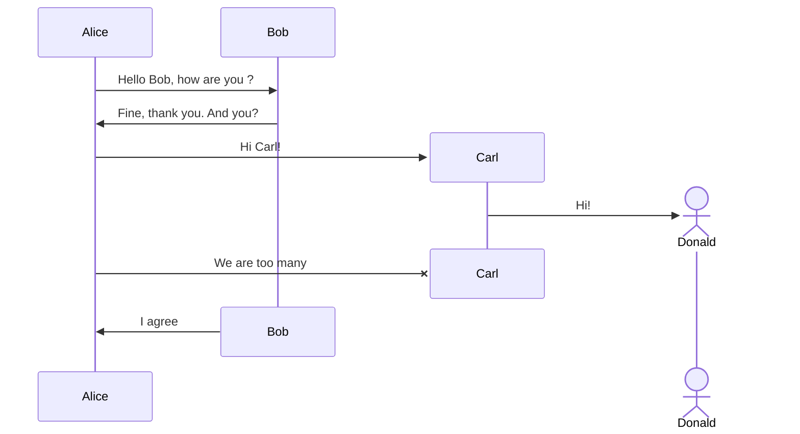

## Grouping with Box

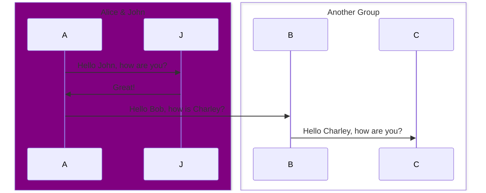

## Message Arrow Types

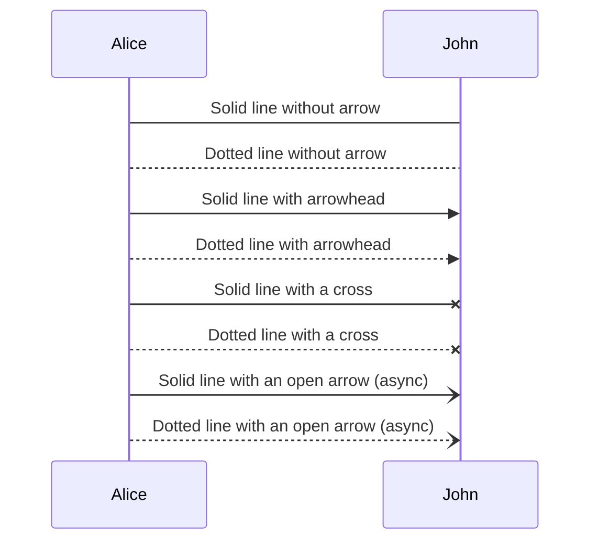

## Bidirectional Arrow Types

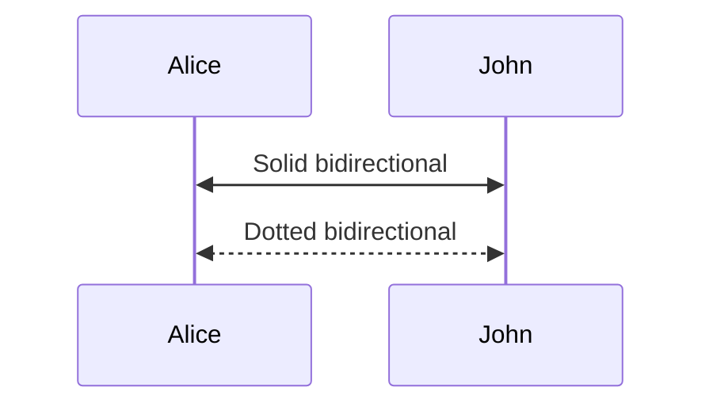

## Central Connections

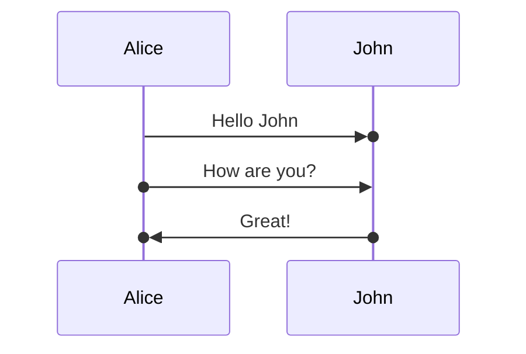

## Activation Explicit

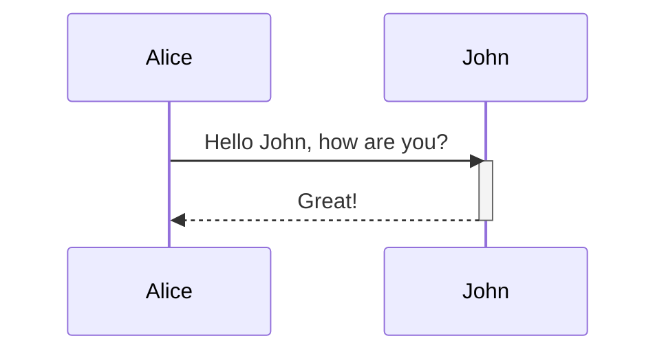

## Activation Shorthand

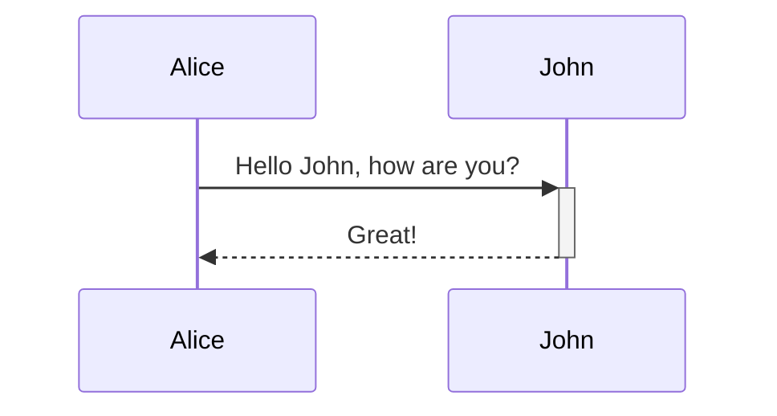

## Stacked Activations

```mermaid
sequenceDiagram
    Alice->>+John: Hello John, how are you?
    Alice->>+John: John, can you hear me?
    John-->>-Alice: Hi Alice, I can hear you!
    John-->>-Alice: I feel great!
```

## Note Right of Participant

```mermaid
sequenceDiagram
    participant John
    Note right of John: Text in note
```

## Note Spanning Participants

```mermaid
sequenceDiagram
    Alice->>John: Hello John, how are you?
    Note over Alice,John: A typical interaction
```

## Line Breaks in Messages

```mermaid
sequenceDiagram
    Alice->>John: Hello John,<br/>how are you?
    Note over Alice,John: A typical interaction<br/>But now in two lines
```

## Line Breaks in Participant Names

```mermaid
sequenceDiagram
    participant Alice as Alice<br/>Johnson
    Alice->>John: Hello John,<br/>how are you?
    Note over Alice,John: A typical interaction<br/>But now in two lines
```

## Loops

```mermaid
sequenceDiagram
    Alice->>John: Hello John, how are you?
    loop Every minute
        John-->>Alice: Great!
    end
```

## Alt and Opt Paths

```mermaid
sequenceDiagram
    Alice->>Bob: Hello Bob, how are you?
    alt is sick
        Bob->>Alice: Not so good :(
    else is well
        Bob->>Alice: Feeling fresh like a daisy
    end
    opt Extra response
        Bob->>Alice: Thanks for asking
    end
```

## Parallel Flows

```mermaid
sequenceDiagram
    par Alice to Bob
        Alice->>Bob: Hello guys!
    and Alice to John
        Alice->>John: Hello guys!
    end
    Bob-->>Alice: Hi Alice!
    John-->>Alice: Hi Alice!
```

## Nested Parallel Flows

```mermaid
sequenceDiagram
    par Alice to Bob
        Alice->>Bob: Go help John
    and Alice to John
        Alice->>John: I want this done today
        par John to Charlie
            John->>Charlie: Can we do this today?
        and John to Diana
            John->>Diana: Can you help us today?
        end
    end
```

## Critical Region with Options

```mermaid
sequenceDiagram
    critical Establish a connection to the DB
        Service-->>DB: connect
    option Network timeout
        Service-->>Service: Log error
    option Credentials rejected
        Service-->>Service: Log different error
    end
```

## Critical Region without Options

```mermaid
sequenceDiagram
    critical Establish a connection to the DB
        Service-->>DB: connect
    end
```

## Break Statement

```mermaid
sequenceDiagram
    Consumer-->>API: Book something
    API-->>BookingService: Start booking process
    break when the booking process fails
        API-->>Consumer: show failure
    end
    API-->>BillingService: Start billing process
```

## Background Highlighting

```mermaid
sequenceDiagram
    participant Alice
    participant John
    rect rgb(191, 223, 255)
    note right of Alice: Alice calls John.
    Alice->>+John: Hello John, how are you?
    rect rgb(200, 150, 255)
    Alice->>+John: John, can you hear me?
    John-->>-Alice: Hi Alice, I can hear you!
    end
    John-->>-Alice: I feel great!
    end
    Alice ->>+ John: Did you want to go to the game tonight?
    John -->>- Alice: Yeah! See you there.
```

## Comments

```mermaid
sequenceDiagram
    Alice->>John: Hello John, how are you?
    %% this is a comment
    John-->>Alice: Great!
```

## Entity Codes for Special Characters

```mermaid
sequenceDiagram
    A->>B: I #9829; you!
    B->>A: I #9829; you #infin; times more!
```

## Sequence Numbers with Autonumber

```mermaid
sequenceDiagram
    autonumber
    Alice->>John: Hello John, how are you?
    loop HealthCheck
        John->>John: Fight against hypochondria
    end
    Note right of John: Rational thoughts!
    John-->>Alice: Great!
    John->>Bob: How about you?
    Bob-->>John: Jolly good!
```
