## Basic State Diagram

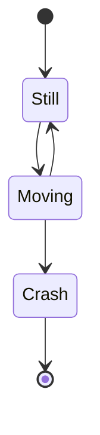

## Simple State Declaration

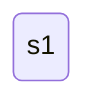

## State Description Using State Keyword

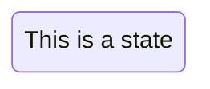

## State Description Using Colon Syntax

## Transition With Label

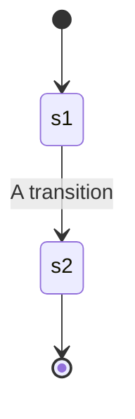

## Start and End States

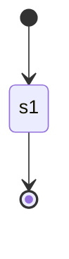

## Composite States

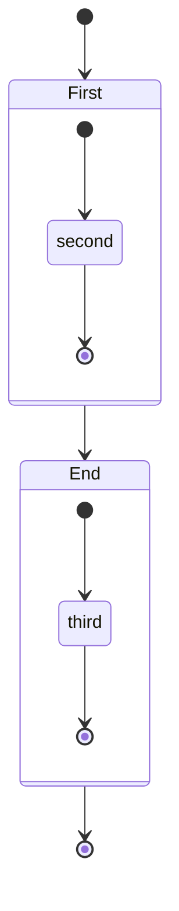

## Nested Composite States

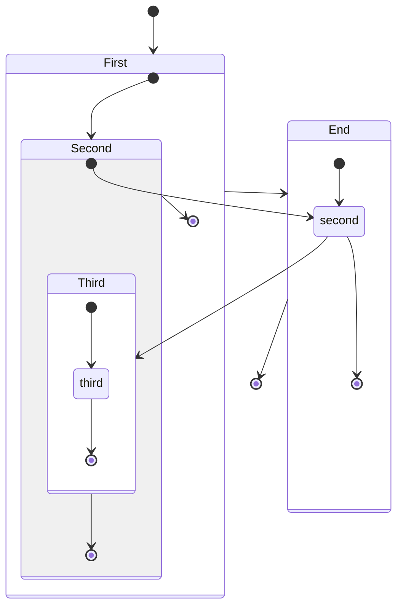

## Transitions Between Composite States

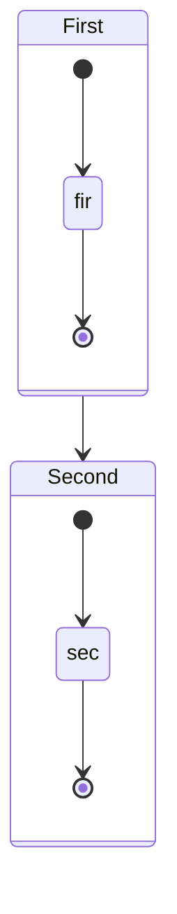

## Choice Pseudostate

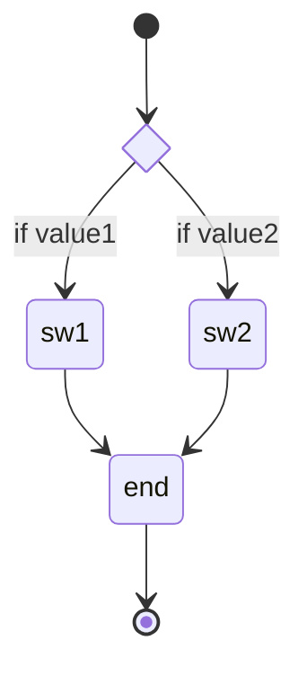

## Fork and Join

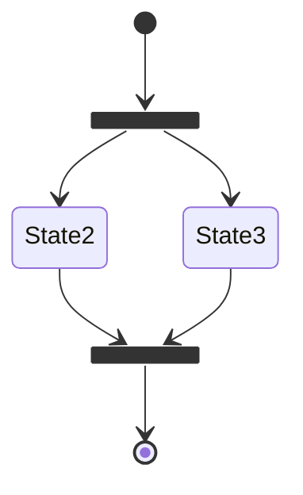

## Notes on States

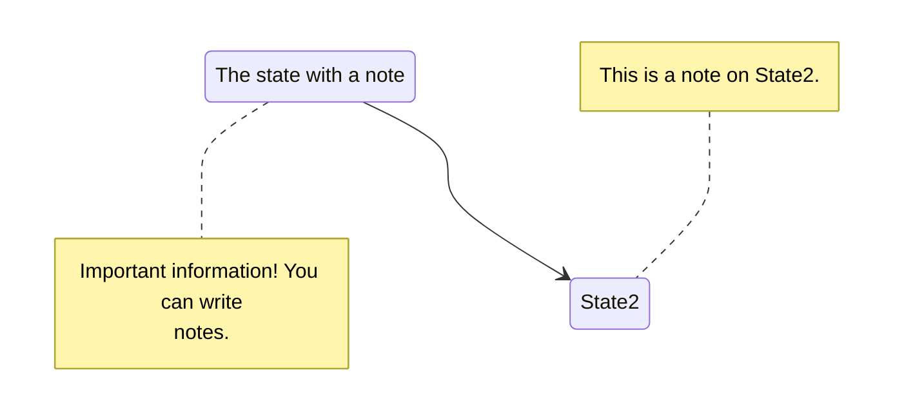

## Concurrency

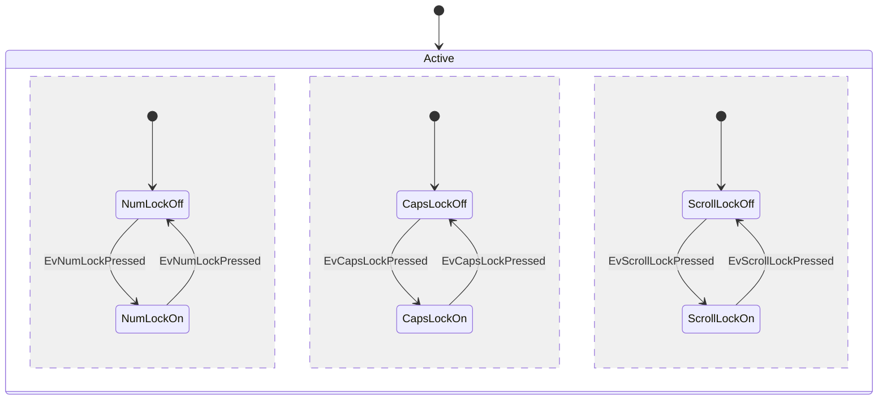

## Direction Left to Right

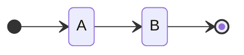

## Direction Left to Right With Transitions

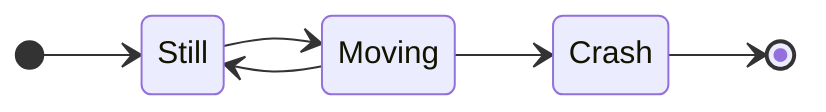

## Comments

## ClassDef Styling

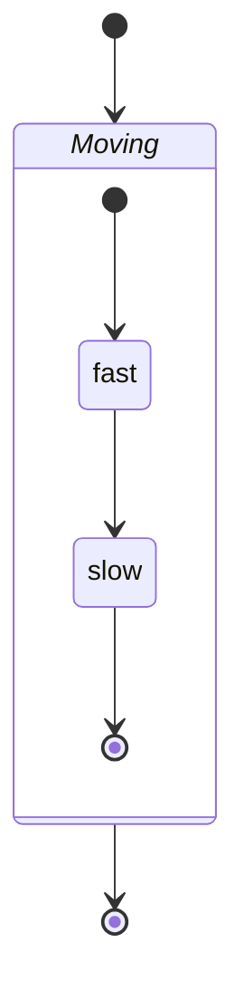

## Applying Styles With Triple Colon Operator

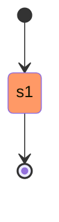

## State With Spaces Using ID Reference

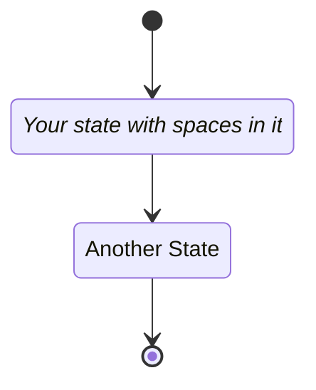
