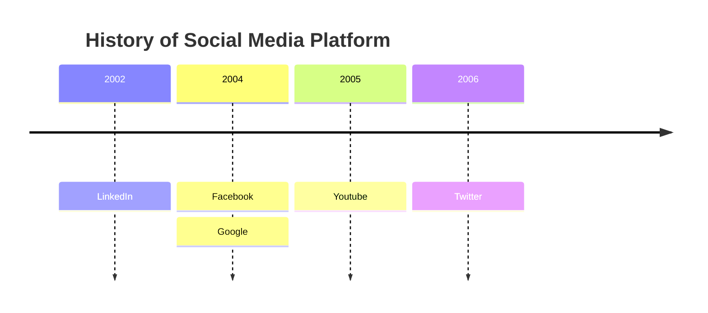
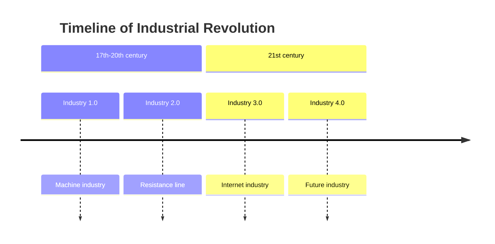
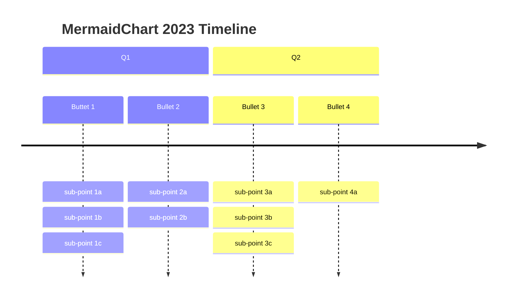
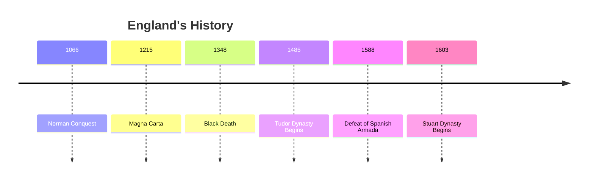
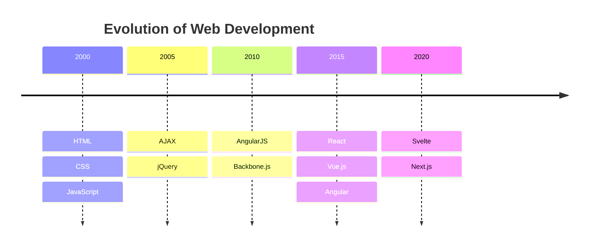
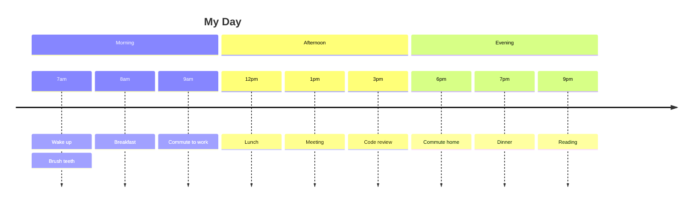
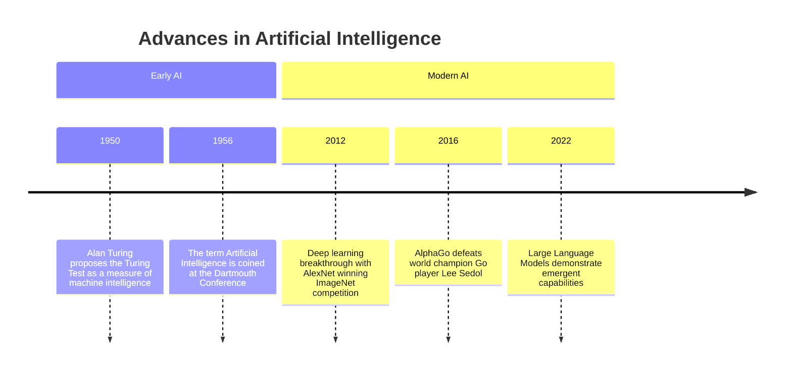
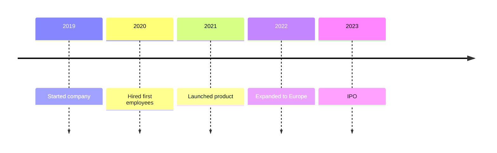
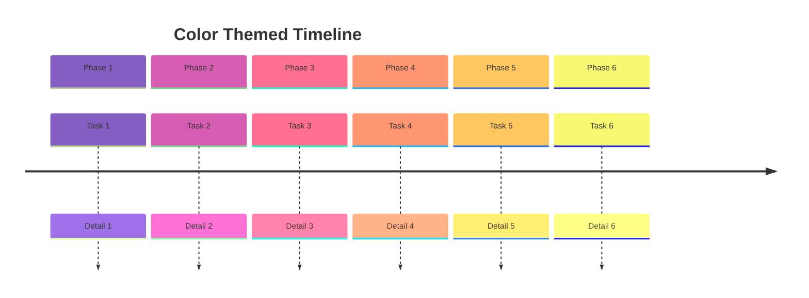
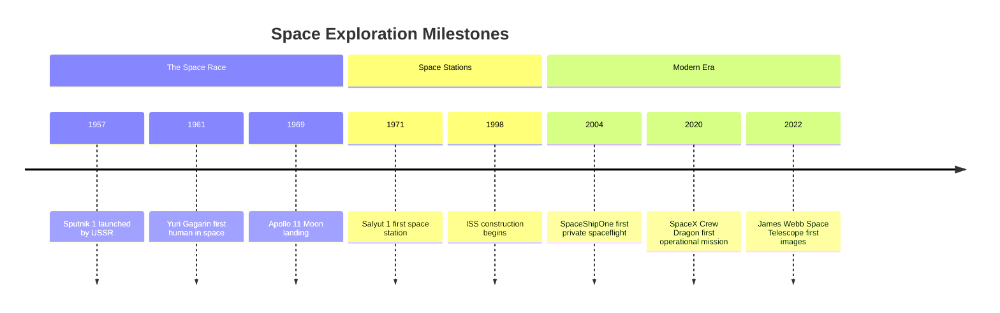

## Basic Timeline

## Timeline with Grouped Time Periods

## Timeline of Major Events

## Timeline Without Sections

## Timeline with Multiple Events per Time Period

## Timeline with Sections and Title

## Wrapped Text in Timeline

## Simple Compact Timeline

## Timeline with Custom Theme Configuration

## Timeline of Space Exploration

