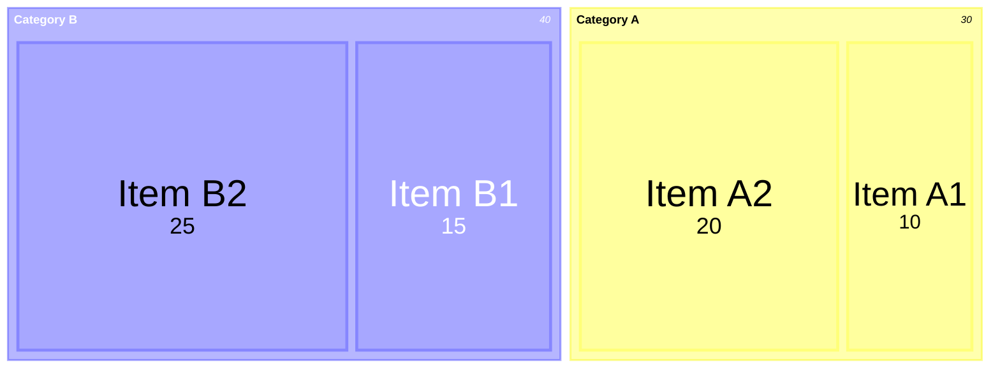
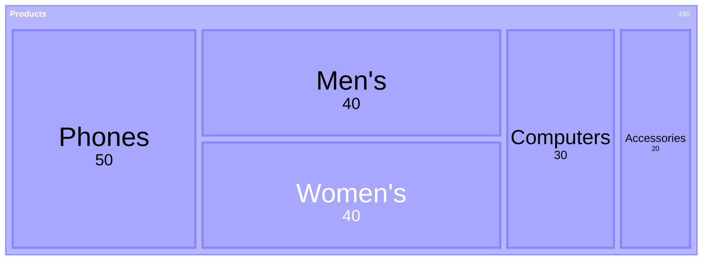
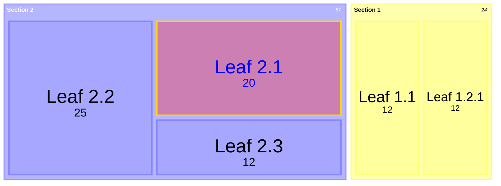
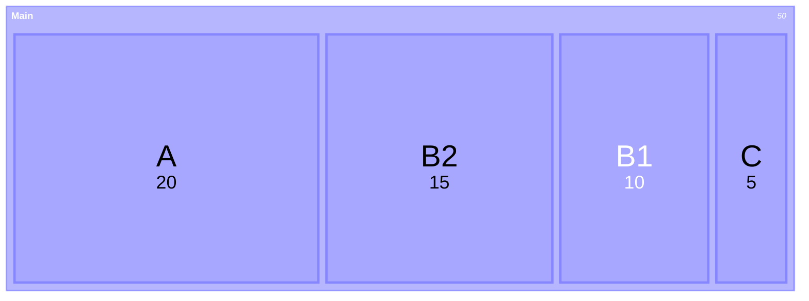
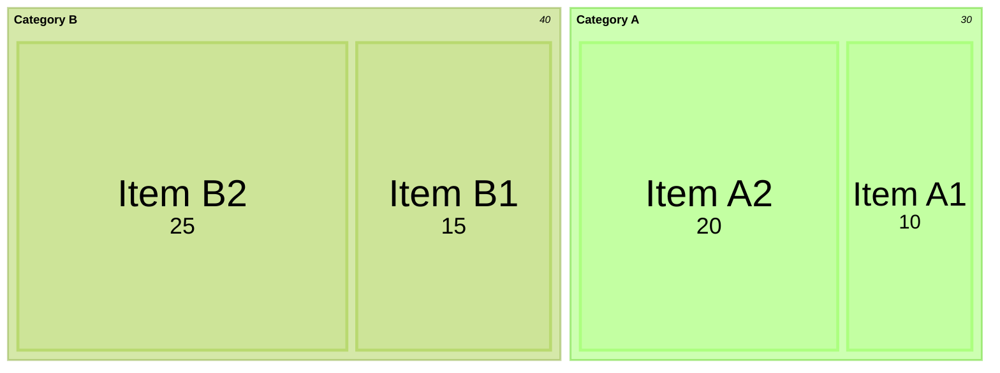
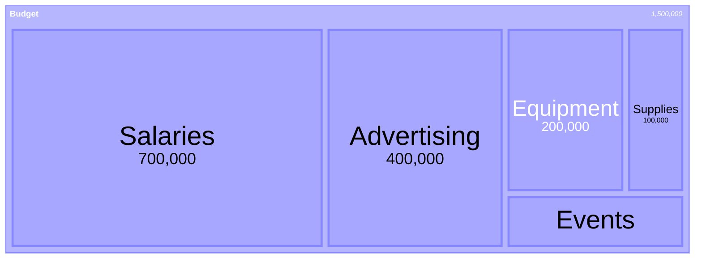
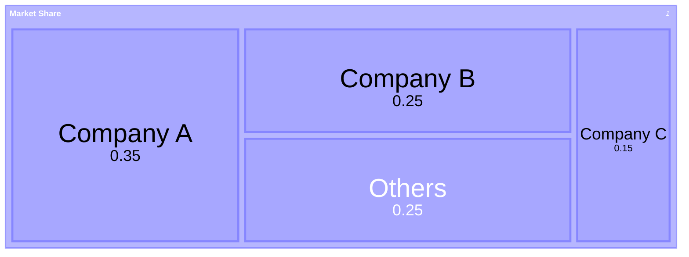

## Basic Treemap

## Hierarchical Treemap

## Treemap with Styling

## Using classDef for Styling

## Theme Configuration

## Diagram Padding

## Currency Formatting

## Percentage Formatting

