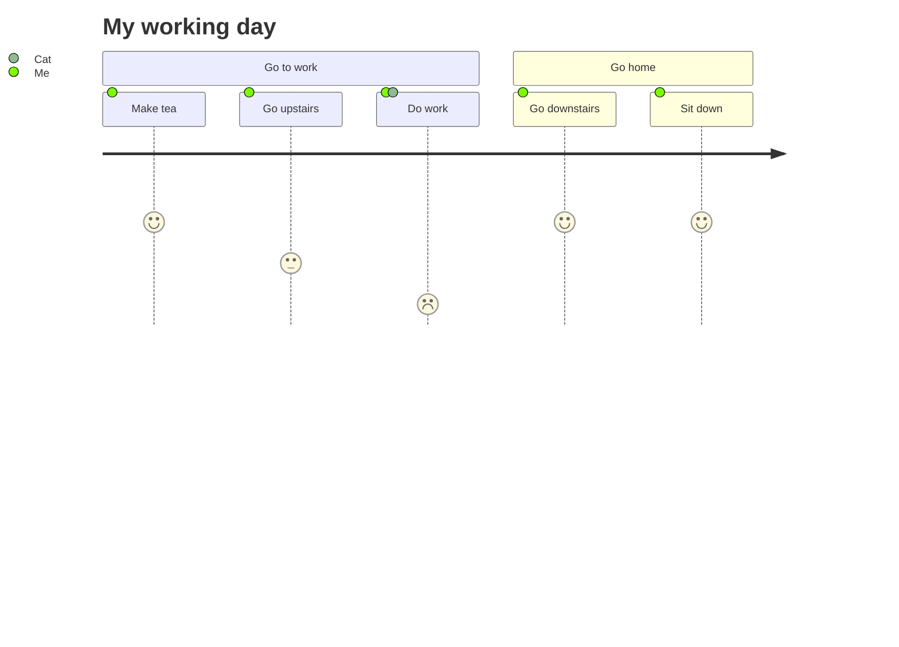
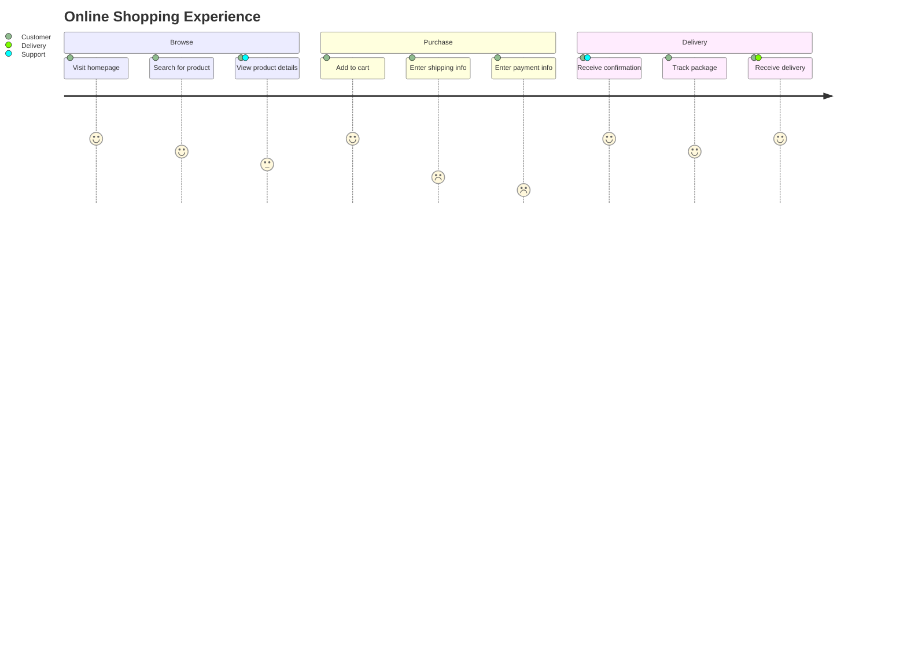
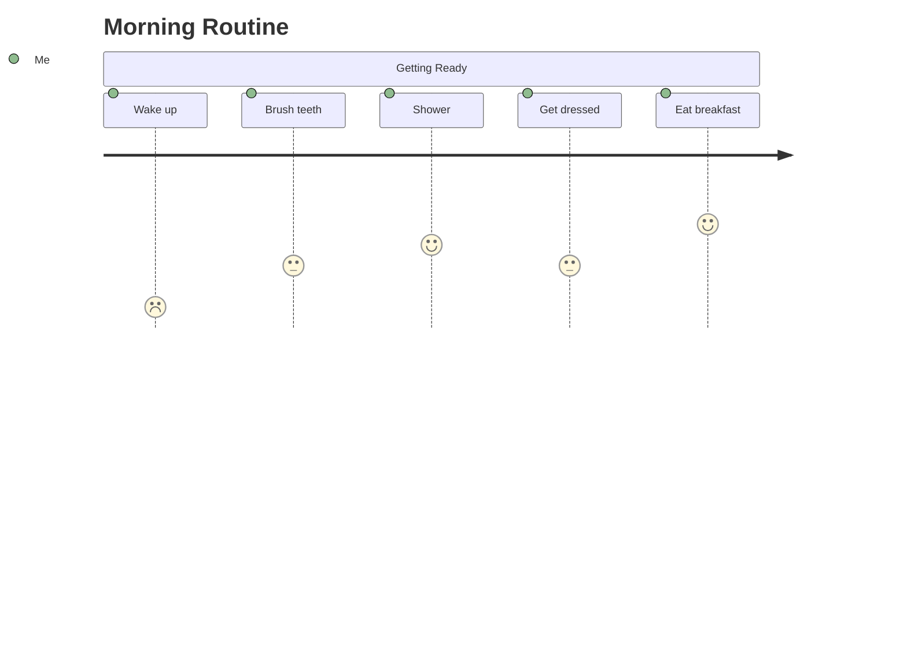
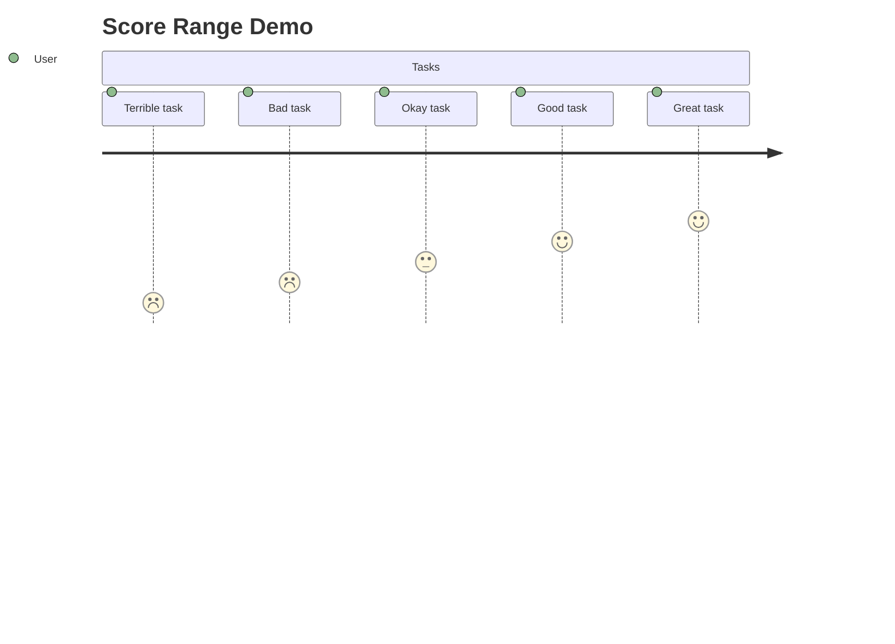
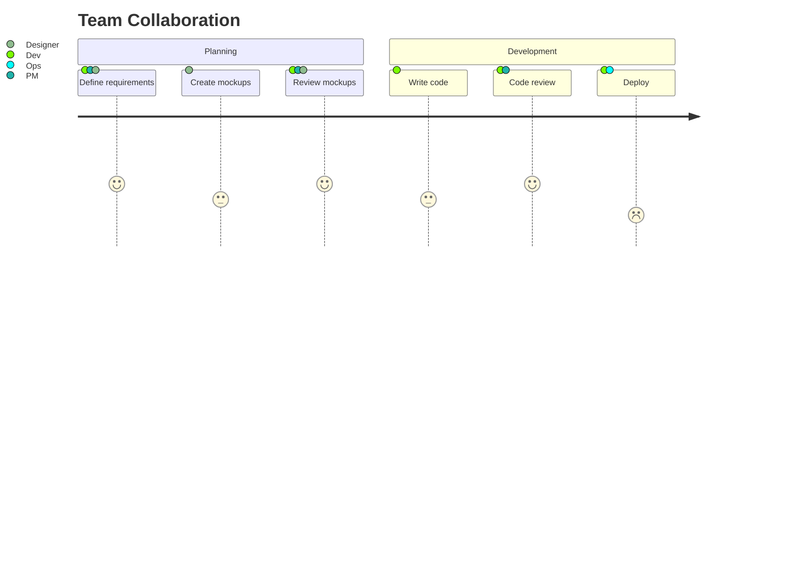
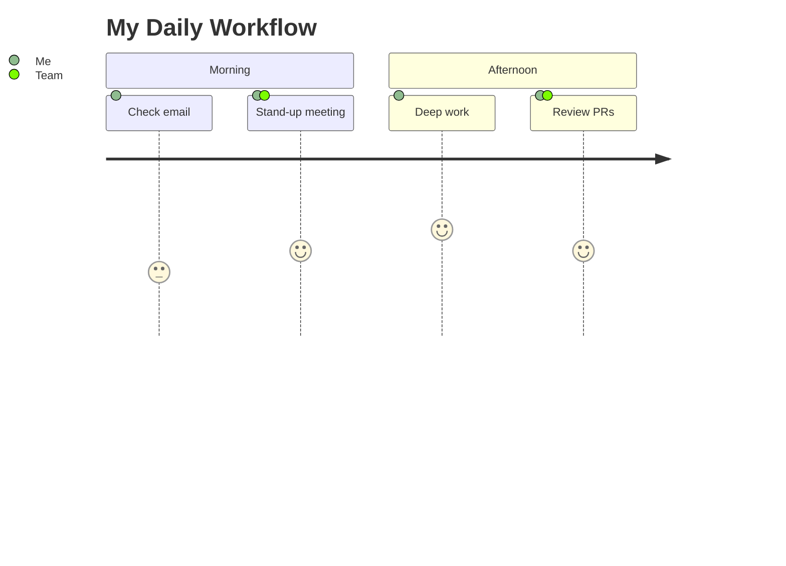
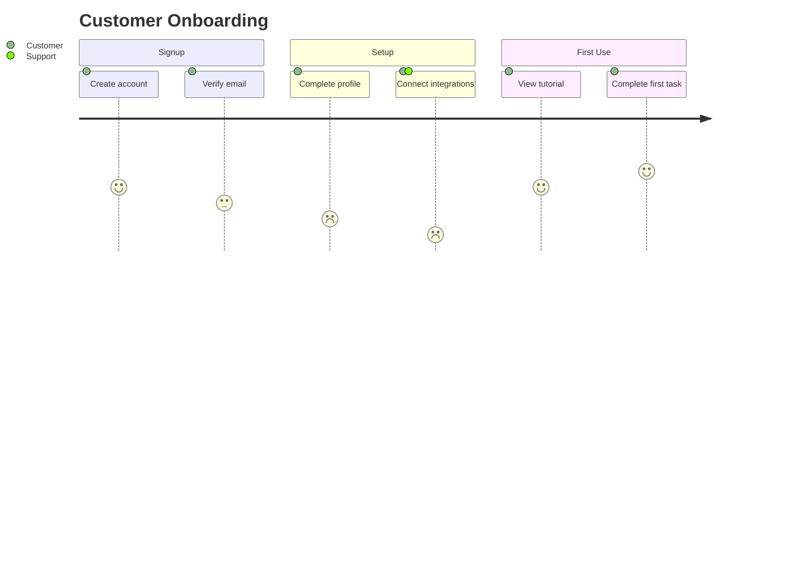
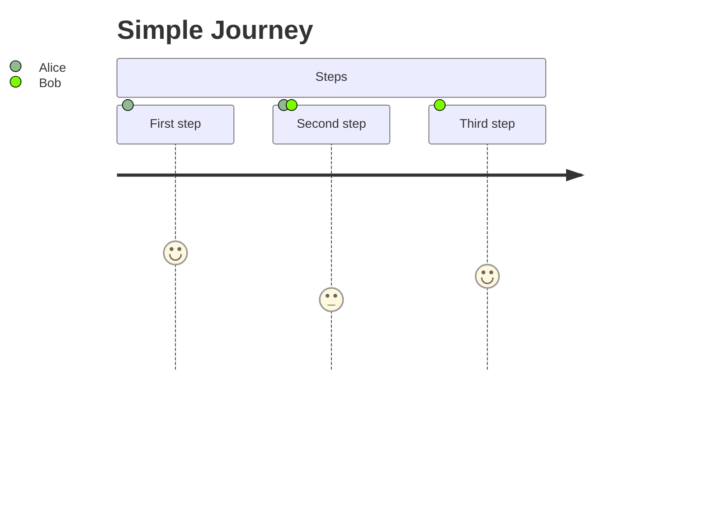

## Basic User Journey

## Multiple Sections With Multiple Actors

## Single Section

## Tasks With Varying Scores

## Multiple Actors Per Task

## Accessible Title and Description

## Multiline Accessible Description

## Title Only With Tasks

