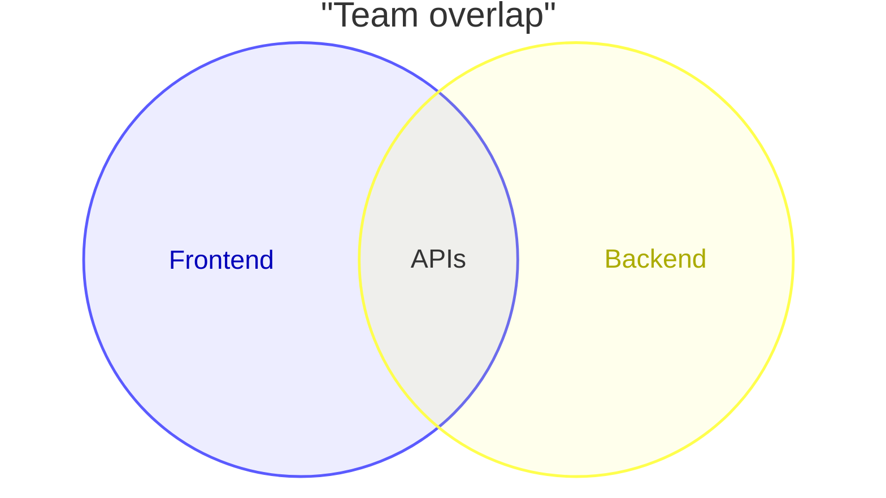
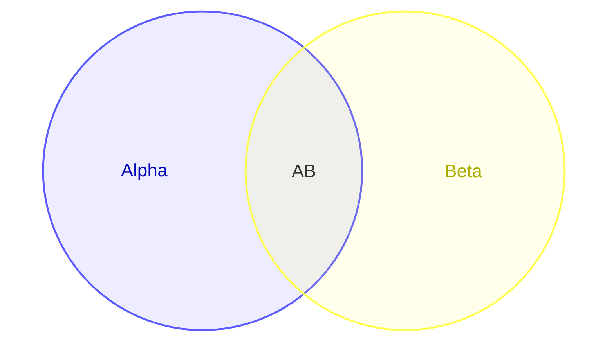
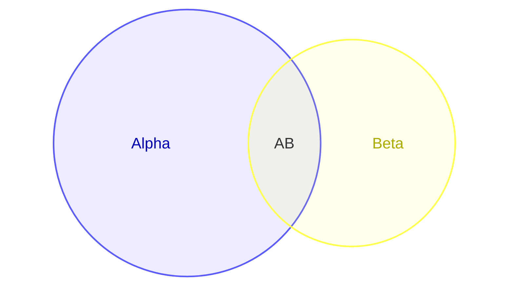
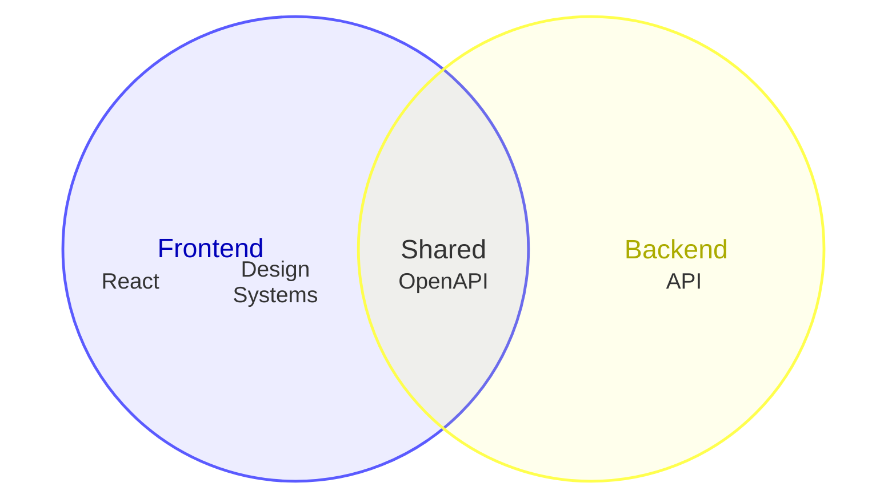
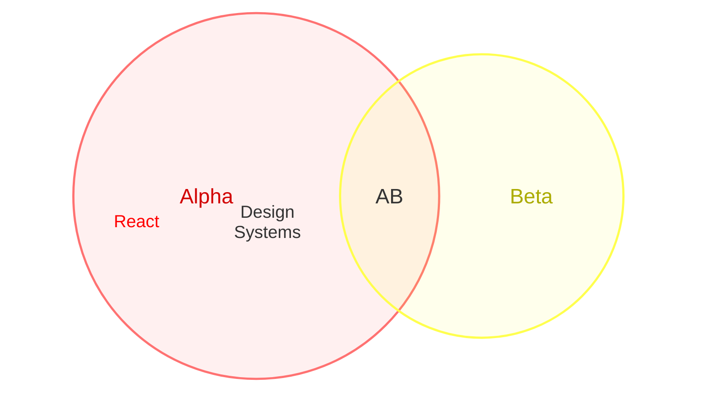

## Basic Venn Diagram with Team Overlap

```mermaid
venn-beta
 title "Team overlap"
 set Frontend
 set Backend
 union Frontend,Backend["APIs"]
```

## Labels with Bracket Syntax

```mermaid
venn-beta
 set A["Alpha"]
 set B["Beta"]
 union A,B["AB"]
```

## Sized Sets and Union

```mermaid
venn-beta
 set A["Alpha"]:20
 set B["Beta"]:12
 union A,B["AB"]:3
```

## Text Nodes Inside Sets and Union

```mermaid
venn-beta
 set A["Frontend"]
 text A1["React"]
 text A2["Design Systems"]
 set B["Backend"]
 text B1["API"]
 union A,B["Shared"]
 text AB1["OpenAPI"]
```

## Styling Sets, Unions, and Text Nodes

```mermaid
venn-beta
 set A["Alpha"]:20
 text A1["React"]
 text A2["Design Systems"]
 set B["Beta"]:12
 union A,B["AB"]:3
 style A fill:#ff6b6b
 style A,B color:#333
 style A1 color:red
```
