## Demo

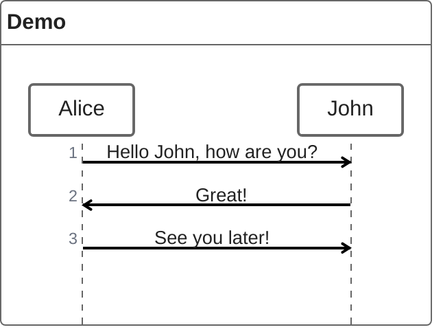

## Declare Participant

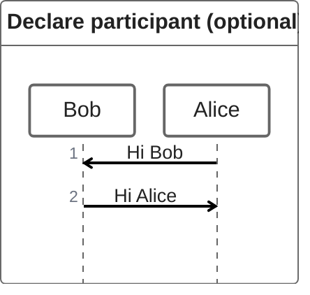

## Annotators

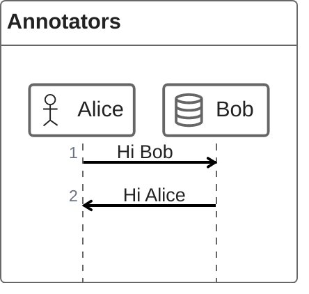

## Aliases

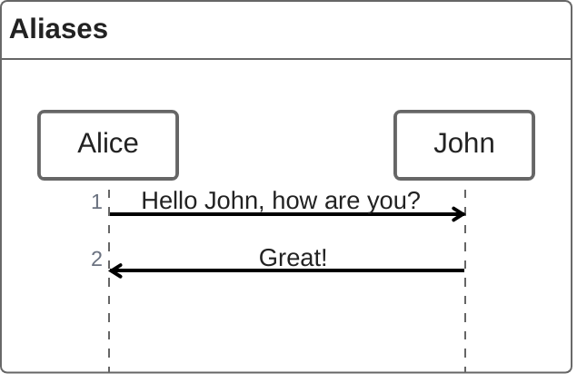

## Sync Message

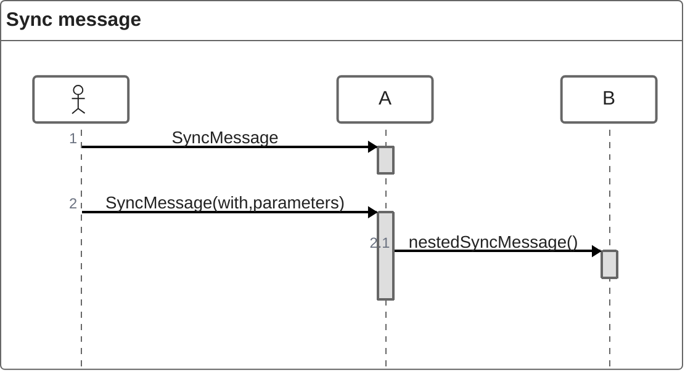

## Async Message

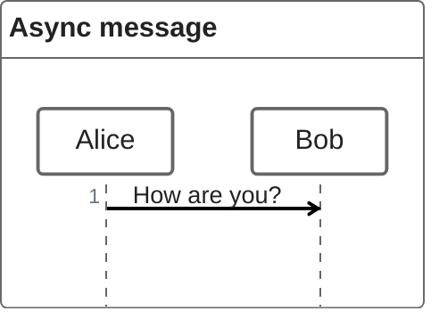

## Creation Message

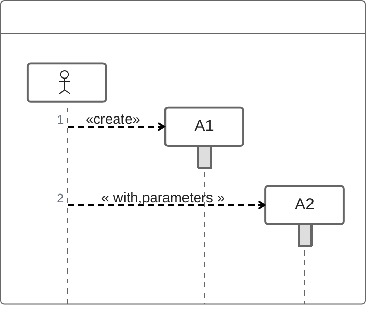

## Reply Message

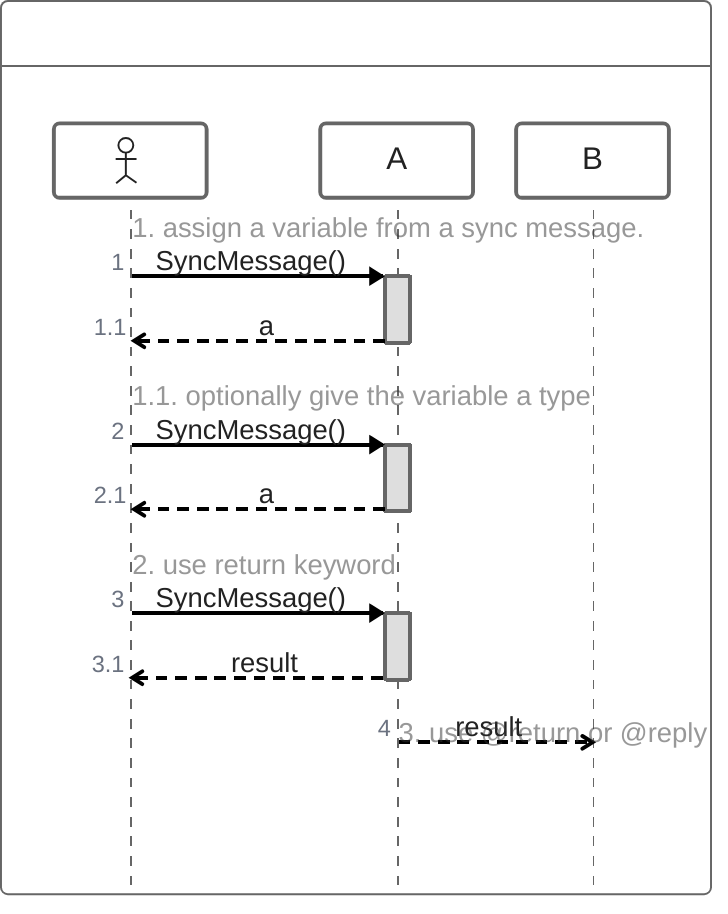

## Reply Message Advanced

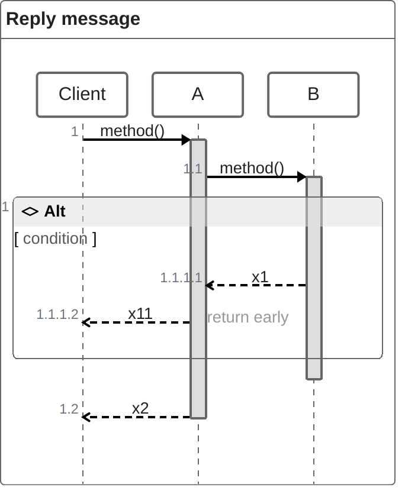

## Nesting

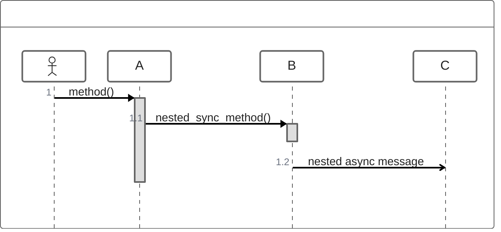

## Comments

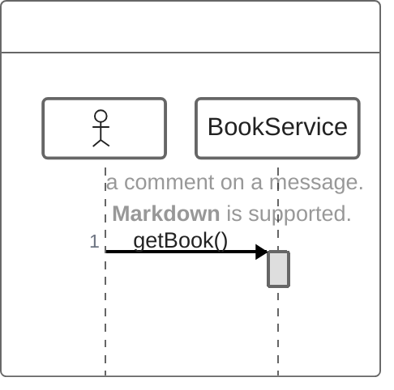

## Loops

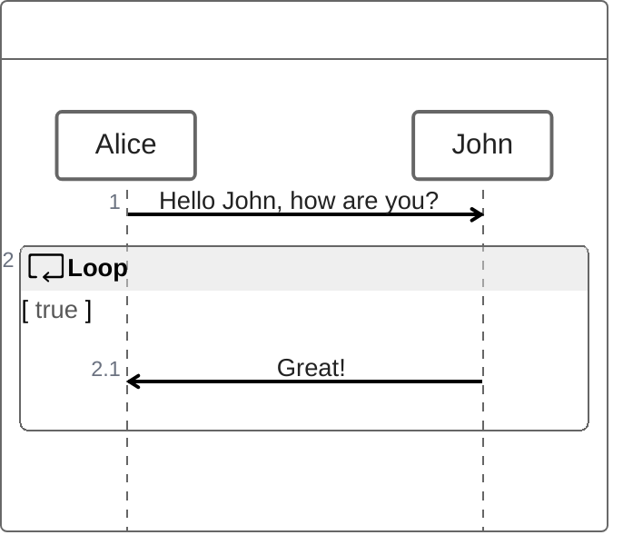

## Alt

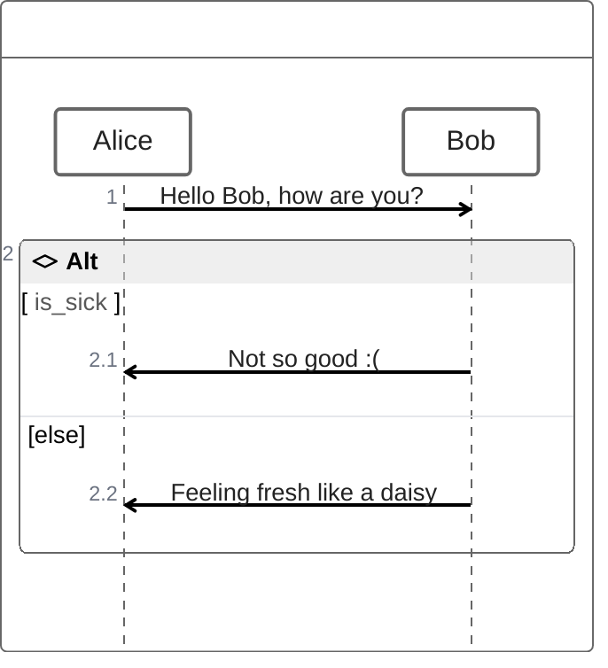

## Opt

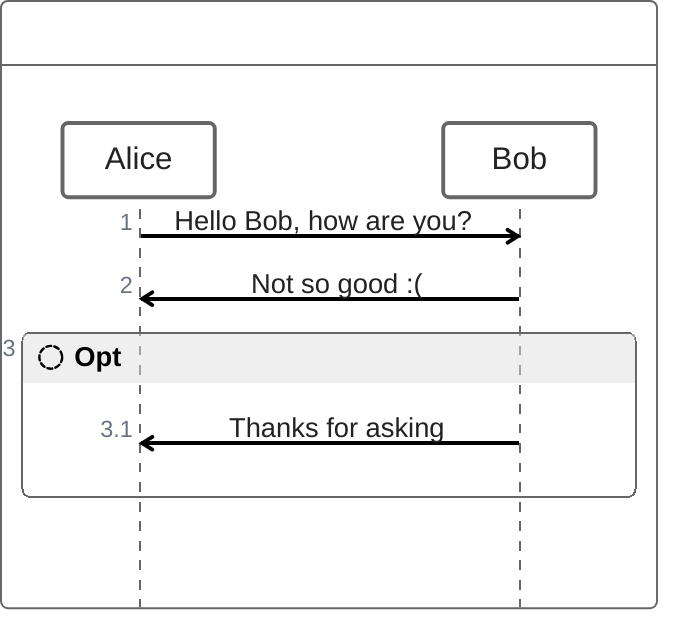

## Parallel

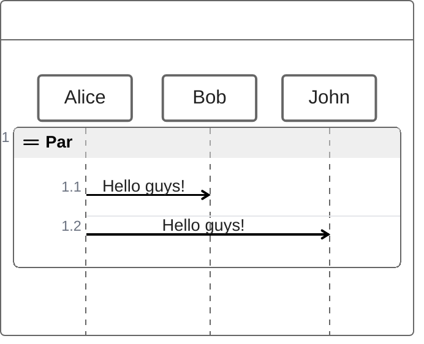

## Try Catch Finally

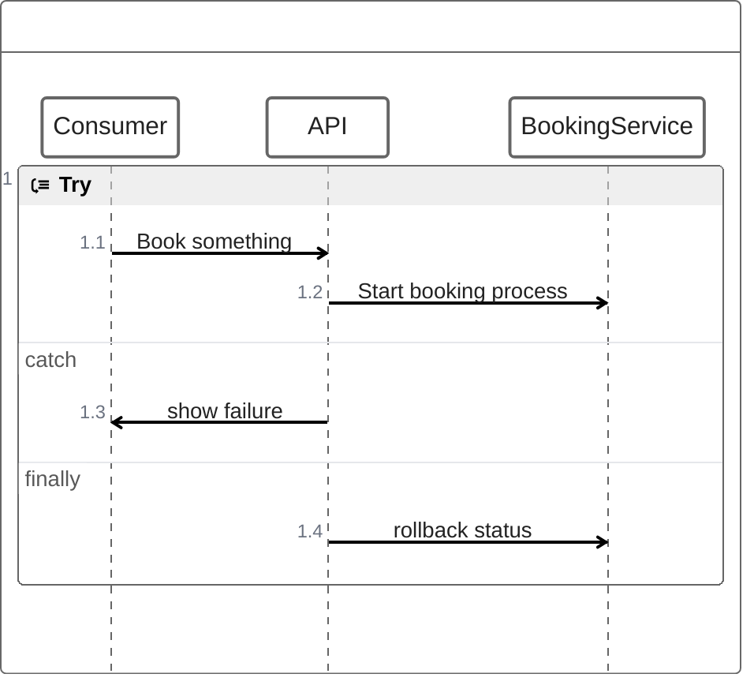
